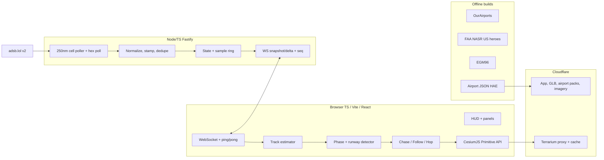

# FlightHopper — Final Working Plan

**Status:** Dual-reviewed hybrid (GPT-5.6 Sol + Claude Fable 5.1)  
**Parents:** `.planning/gpt-sol-design.md`, `.planning/fable-design.md`  
**Reviews:** `.planning/gpt-sol-review.md`, `.planning/fable-review.md`  
**Date:** 2026-09-22  

**Dual-model verdict:** Both bless this hybrid over either parent alone (**Yes-with-caveats**). Required amendments from review consensus are incorporated below.

**Safety:** Entertainment / situational awareness only — **not for navigation, ATC, or operational decisions**.

---

## Dual-review consensus (locked amendments)

| Issue | Amendment |
|---|---|
| Playback delay | **Adaptive:** `D = clamp(p90(gap)+1s, 3s, 10s)`; floors ADS-B v2 ≥3s, v0/1 ≥4s, MLAT ≥6s. Must stay ≥ cell poll interval + 1s. |
| Cell polling | **~250 nm overlapping circles**, browse poll **every ~3 s**, global token bucket (~2 req/s, halve on 429). **1 Hz only** for chased hex via `/v2/icao/{hex}` (deduped across clients). No 1° cells at 1–2 Hz. |
| Extrapolation | Predictive motion **stops at 8 s**; then freeze/fade/ghost. No silent “coast as if live.” |
| NASR vs CIFP PG | **NASR for US hero airports in MVP.** **CIFP entirely → v2** (with procedures). No ARINC parser in v1. |
| Airports MVP | OurAirports rectangles + hand-verified hero thresholds + imagery. **All OSM → v1.** |
| Estimator correctness | **Dedupe** by `t_sample` (adsb.lol re-serves same point). **Ping/pong clock sync.** Baro→HAE ladder when geom missing (below). WS **sequence** + gap → snapshot. |
| Imagery | **EOX Sentinel-2 cloudless** (CC BY-NC-SA → MVP non-commercial) + keyed high-res near heroes (MapTiler/Esri). |
| ToS / rights | **Public-launch gate** (not a build blocker): rights matrix for live ADS-B, terrain, imagery — rates, cache, ODbL/derivative DB, attribution, commercial, kill switch. |
| Own feeder | **Phase 0:** order/online a cheap ADS-B receiver — path to adsb.lol RE-API/keys and goodwill. |
| Touchdown acceptance | At first `onGround`: \|alt_geom HAE − surface HAE\| ≤ 10 m **before** clamp (tests datum); clamp blend pop ≤ 1–5 m; runway endpoint accuracy measured separately. |
| Hop (MVP) | Phase ranking only within ~15 nm of indexed airports; else nearest. Graceful empty set. |
| Glide ribbon | **Centerline in MVP** (flag); **nominal visual glidepath** ribbon + dots in **v1**; never imply published/assigned approach. |
| PostGIS | Not for search (~1 MB static index). PostGIS only if admin override UI appears. |
| Fallbacks | Until agreements exist: **one live source** + degraded-mode banner. No pretend multi-provider HA. |
| Client abuse | Cap subscription bbox area and max aircraft server-side. |
| Mobile | MVP = measure ≥30 FPS on one target phone + drop-layer flags. Designed battery-saver UX → v1. |
| Schedule | Solo MVP realistically **~8–10 weeks**, not 4–8. |

---

## 1. Product vision

1. Browse live aircraft on a Cesium globe.  
2. Select → optional **Follow** → **Chase** (behind/above).  
3. Honest HUD: GS, ALT (baro primary display / geom for render), VS, TRK, HDG when known, AGL, data age, source quality — **Observed / Derived / Stale / Unknown**.  
4. Watch takeoffs/landings on real terrain + runways with adaptive spectate delay.  
5. **Hop** to next interesting aircraft (activation-radius ranked; else nearest).

Non-goals: certified nav, ATC, collision avoidance, aerodynamic sim, claiming runway/destination as ATC truth.

---

## 2. Architecture

| Layer | Choice |
|---|---|
| Frontend | TS, Vite, React (DOM only), Cesium engine, Zustand; Worker for fleet positions **after profiling** |
| Backend | Node 22, Fastify + ws; Redis only at 2+ replicas |
| Edge | Cloudflare Pages / Workers / R2 |
| Airports | Versioned static JSON + compact global index |
| Live data | adsb.lol via fan-in; provider adapters; degraded mode until fallbacks licensed |

---

## 3. Data plane

- Interest-driven **250 nm** cells; idle stop after grace.  
- Server: `t_sample = t_recv − seen_pos`; **drop unchanged t**.  
- Client: clock offset via ping/pong; render at `t_server − D` (adaptive).  
- Cubic Hermite (velocity-aware) between samples.  
- Quality tiers; heavier delay/smoothing for MLAT; no approach dots on MLAT.  
- Routes optional (routeset/adsbdb lookup cache only — no bulk republish).  
- WS sequence numbers; gap → full snapshot.

### Altitude

- **HUD ALT:** barometric (aviation default); geom secondary.  
- **Render height ladder:** `alt_geom` → `alt_baro+(nav_qnh−1013.25)×27+N` → `alt_baro+N+learned ground bias` → clamp ≥ terrain/runway + gear. Label **alt est.** when not geom.  
- **Ground:** prefer engineered runway/taxi plane when spatially consistent; terrain fallback; blend only after strong ground evidence.

---

## 4. Chase / camera / HUD

- Browse billboards → chase glTF (Primitive).  
- Follow mode kept (cheap bridge).  
- Presets: Chase / Low / Wing / Runway / Tower; optional phase auto-switch.  
- Terrain collision clearance; damped heading; mostly level horizon.  
- Calibration scene + model manifest (axis, gear, length).

---

## 5. Airports & terrain

| When | What |
|---|---|
| Phase 0 | Terrarium→CustomHeightmap + EGM96 at KSFO/LOWI; decode budget; recorded ICAO fixtures |
| MVP | OA runways; NASR overrides for US heroes; hand-verified thresholds; Sentinel-2 + hero imagery |
| v1 | OSM pavement/taxi/apron; centerline+**nominal** 3° ribbon + dots; NASR automation |
| v2 | CIFP procedures (US), AIRAC lifecycle; optional bulk feed |

---

## 6. Roadmap

### Phase 0 — Spikes (1–2 weeks)

Exit criteria:
- Terrarium+EGM96 live at KSFO/LOWI; threshold HAE vs airport JSON within ~10 m; tile-decode p95 budget held after first measurement.
- One glTF calibrated on known runway heading; model manifest exists.
- Three recorded `/v2/icao` fixtures (cruise, arrival, MLAT) replay: no snap >20 m / 5 min on ADS-B v2; turns as arcs.
- Provider request economics documented; feeder receiver ordered/online.

### MVP — Chase + hero airports (~8–10 weeks solo)

Browse / Follow / Chase / bounded Hop; 250 nm / 3 s cell poller + chased hex 1 Hz; WS seq+snapshot; adaptive D; honest HUD; OA+NASR heroes; centerline flag; Terrarium+EGM96; Sentinel-2 + hero imagery; attribution; degraded-mode UX; dataset registry JSON (incl. adsb.lol ODbL note); client bbox caps; rights matrix drafted (launch gate).

Acceptance extras: upstream ≤1 req/cell/3 s regardless of clients; 24 h soak with zero uncontrolled 429s (50 synthetic clients).

### v1 — Approach realism

Nominal glide ribbon+dots; OSM geometry; reconnect/soak; search/share + privacy; mobile polish; Redis if 2 instances.

### v2 — Procedures & scale

CIFP; negotiated bulk feed; optional history+privacy; premium imagery behind user key.

---

## 7. Hard risks

1. adsb.lol rate/ToS → adapters + rights matrix + degraded mode.  
2. Terrarium heightmap hypothesis → Phase 0 or die.  
3. Datum/runway warp → EGM96 + planar runway (not coarse terrain as shape).  
4. Imagery licensing → provider interface from day one.  
5. Distributed demand > point-API budget → no global-coverage promise.  
6. Demo traffic luck → recorded replay fixtures.

---

## 8. Why this beats either parent alone

| From Sol | From Fable | Review-fixed regressions |
|---|---|---|
| Follow mode; Observed/Derived/Stale; SLOs/ToS rigor; NASR; interest-driven fan-in; test fixtures; sequence recovery | EGM96 day-one; Hermite craft; phase machine; Hop; camera presets; Primitive API; size-class gear; CF terrain proxy; static packs | Adaptive D; 250nm/3s poll; CIFP→v2; imagery row; dedupe+clock sync; honest touchdown metrics; single-provider degraded mode until fallbacks licensed |

---

## 9. Ship gate (both reviewers)

[GPT Sol](c904e23a-f885-46ab-9afb-2d8a46cd398b) and [Fable](0aa28242-d273-499d-9338-ea0bc8ce0511): **Yes-with-caveats.**

Build against this plan after § Dual-review consensus is locked (done above).  
**Public launch** additionally requires the source-by-source production-rights matrix (live, terrain, imagery) completed — not a Phase 0/MVP coding blocker.
