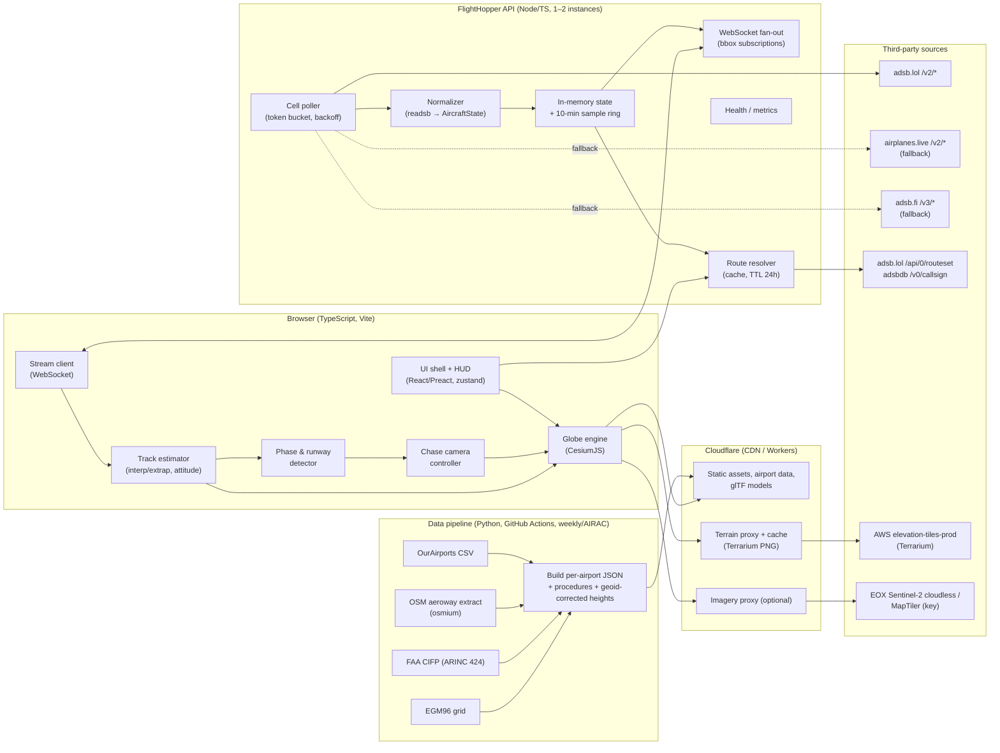
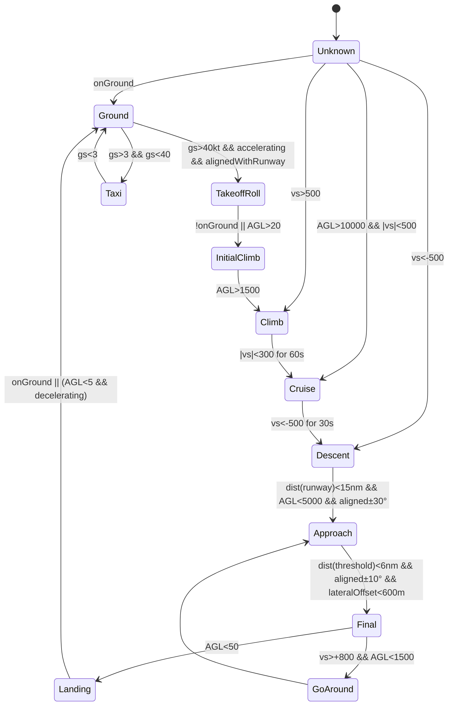

# FlightHopper — System Design Document

**Status:** Proposed architecture, v0.1
**Scope:** Live ADS-B globe viewer with third-person aircraft "chase" view, realistic flight HUD, and geographically correct takeoff/landing visualization against real terrain and runways.
**Target team:** 1–3 engineers. Optimize for an impressive chase-view MVP that can grow into a production service without a rewrite.

---

## 0. Executive summary and key decisions

| # | Decision | Recommended default | One-line rationale |
|---|---|---|---|
| D1 | Rendering engine | **CesiumJS** (single engine for 2D and 3D) | Only mature OSS engine with a true WGS84 globe, streaming terrain, glTF models, and a free camera that can sit 150 m behind an aircraft at 50 ft AGL. |
| D2 | Primary live data | **adsb.lol v2 API** via our own aggregating backend | No key, readsb-schema (richest fields: `roll`, `true_heading`, `baro_rate`, `geom_rate`, `nav_*`, `seen_pos`), but dynamic rate limits → fan-in through one poller. |
| D3 | Backend | **Thin Node/TypeScript service** (poller + WebSocket fan-out + caches) behind Cloudflare | N users must not equal N upstream polls; also needed for CORS, clock stamping, route caching, terrain caching. Client-direct polling kept as a dev flag. |
| D4 | Terrain | **Terrarium tiles (AWS Open Data)** through a caching proxy into Cesium's `CustomHeightmapTerrainProvider`, with **EGM96 geoid correction** | Free, global, no ToS entanglement; Cesium ion Community plan is non-commercial only. Geoid correction is mandatory or runways float/sink by up to ~100 m. |
| D5 | Runway geometry | **OurAirports `runways.csv`** (public domain) for thresholds/dimensions + **OSM `aeroway=*`** (ODbL) for pavement polygons + **FAA CIFP `PG` records** for US threshold elevations/TCH | Layered: MVP works with OurAirports alone; realism grows without changing the client contract. |
| D6 | Altitude source near ground | **Geometric altitude (`alt_geom`, WGS84 HAE)** first; baro corrected by `nav_qnh` second; terrain-clamp when `alt_baro == "ground"` | ADS-B geometric altitude is already in Cesium's datum; baro is pressure altitude (QNE) and can be off by ±1000 ft. |
| D7 | Motion smoothing | **Delayed-playback interpolation** (render ~4 s behind live, cubic Hermite with velocity) + bounded dead-reckoning when the buffer starves | Interpolation between two known samples looks vastly better than extrapolation; a few seconds of latency is invisible to a spectator. |
| D8 | Transport server→client | **WebSocket** with snapshot + delta frames, binary-optional | Push is cheaper than N clients polling and lets us guarantee ≤1 upstream poll per cell. |
| D9 | Approach realism | **Runway alignment layer (extended centerline + 3° glidepath ribbon + deviation readouts)** in v1; **CIFP STAR/approach overlays** in v2 (US only) | The alignment ribbon delivers 80% of the "wow" for 10% of the effort; CIFP is a data-engineering project on its own. |
| D10 | Product name/hook | **FlightHopper** — "hop" between aircraft; `N`/`Tab` jumps to the next interesting aircraft (nearest on final, nearest departing, etc.) | Gives the product a verb and a reason to stay in chase mode. |

---

## 1. Product UX flow

### 1.1 Core loop

```
Browse globe → pick aircraft → Chase view + HUD → (auto) Approach/Departure mode → Hop to next aircraft
```

**Browse.** The user lands on a globe centered on their approximate location (IP geolocation, no permission prompt) at a ~250 nm view. Aircraft render as oriented icons (billboards) colored by altitude, with labels appearing at closer zoom. A search box accepts callsign, registration, hex, airport ICAO/IATA. Filters: military, emergency squawk, "on approach", "departing", altitude band.

**Select.** Click/tap an aircraft → side panel (desktop) or bottom sheet (mobile) with identity (callsign, registration, type, operator), route (origin → destination when known), and a large **"Chase"** button. A single-click also draws the aircraft's recent trail and, if the destination is known, a faint great-circle to it.

**Chase.** The camera flies (1.5 s eased transition) to a position behind and above the aircraft. The HUD appears. The aircraft is rendered as a glTF model; other aircraft remain as icons. The trail persists behind the aircraft. The user can:

- Drag to orbit around the aircraft (temporary offset; recenters after 5 s idle unless "sticky" toggle is on).
- Scroll/pinch to change chase distance within clamps.
- Press `1`–`5` to switch camera presets (see §4.3).
- Press `N` / swipe to **Hop** to the next candidate aircraft (ranked: same airport on final > nearest to viewer > interesting types).
- Press `Esc` / "Exit chase" to return to the browse camera at the aircraft's location.

**HUD.** Always-visible primary group (large, monospace, no chrome): `GS`, `ALT`, `V/S`, `TRK` with `HDG` shown when it differs by >3° (crab indicator). Secondary group: AGL altitude, baro/geom source badge, squawk, phase chip (e.g., "FINAL RWY 27L", "CLIMB", "CRUISE FL370"), data-age indicator ("live −5 s"), source badge (ADS-B / MLAT / TIS-B / ADS-C). Units toggle (kt·ft·fpm ↔ km/h·m·m/s). Optional small attitude ball driven by estimated pitch/roll.

**Approach/Departure following.** When the phase detector (§3.7) says the aircraft is within ~15 nm of a runway and descending aligned with it, the UI:

1. Highlights the predicted runway on the globe, draws the extended centerline (10 nm) and a translucent 3° glidepath ribbon from the threshold.
2. Adds localizer/glideslope-style deviation dots to the HUD (lateral meters / vertical dots from a nominal 3° path).
3. Offers "Runway cam" and "Tower cam" presets; auto-switches to "Low chase" below 300 ft AGL unless the user locked a preset.
4. On touchdown (`alt_baro == "ground"` or AGL < 5 m with decelerating GS), shows a discreet "Landed RWY 27L · 14:32:10Z" toast; the camera slows its heading follow so the rollout is watchable.

Departures mirror this: on-ground → accelerating GS > 60 kt aligned with a runway → "TAKEOFF RWY 09" chip → initial climb camera preset (lower and further back to show the rotation).

### 1.2 Camera behavior rules (summary; full spec §4.3)

1. The camera never intersects terrain (min 15 m AGL) and never goes below the aircraft when the aircraft is on the ground.
2. Heading follow is critically damped (time constant ≈ 1.2 s), never instantaneous, so a 25° bank turn reads as a smooth arc, not a whip.
3. Pitch and range are per-preset constants scaled by aircraft size class, not by speed, so the model stays a constant screen size.
4. User orbit input is additive to the preset and decays back unless sticky.
5. Transitions between presets are 0.8 s eased flights, never cuts.
6. When data goes stale (>15 s without a position), the model holds its dead-reckoned position with a "ghost" material; at >60 s, chase exits with a toast.

### 1.3 Mobile vs desktop

| Concern | Desktop | Mobile |
|---|---|---|
| Layout | Side panel + bottom HUD strip | Bottom sheet (peek/half/full) + compact HUD in top-safe area |
| Chase camera | pitch −12°, FOV 60° | pitch −15°, range ×1.3, FOV 70° in portrait so the aircraft sits in the upper third above the sheet |
| Rendering budget | Full terrain detail (`maximumScreenSpaceError` 2), up to 30 glTF models | Reduced terrain (`maximumScreenSpaceError` 6–8), `resolutionScale` 0.75, only the chased model + ≤5 nearest as models, 30 fps cap for battery |
| Input | Mouse orbit, keyboard presets/hop | One-finger orbit, two-finger pinch range, swipe left/right to Hop |
| Data | Full-viewport subscription | Smaller subscription radius (100 nm) + selected aircraft |
| Offline | n/a | Static airport data cached in IndexedDB |

Cesium runs on modern mobile GPUs but memory is the binding constraint; the feature-flag system (§6.4) must allow the whole approach-realism layer to run on a phone with no buildings and low-LOD terrain.

---

## 2. Architecture

### 2.1 Component diagram



### 2.2 Why CesiumJS (and not the alternatives)

| Requirement | CesiumJS | MapLibre GL (globe) + deck.gl | Three.js + custom globe | Unity/Unreal WebGL | Google Photorealistic 3D Tiles (via Cesium) |
|---|---|---|---|---|---|
| True ellipsoidal globe with streaming terrain | Native (quantized-mesh, heightmap) | Globe projection exists; terrain via raster-DEM; pitch capped, no camera below ~horizon-grazing angles at low altitude | Build it yourself (months) | Cesium for Unreal exists but WebGL export is impractical | Yes (terrain baked into tiles) |
| Free camera behind an aircraft at 50 ft AGL looking along the runway | Yes | No — camera model is map-centric (center + pitch ≤ ~85°, altitude constraints) | Yes | Yes | Yes |
| glTF models with per-frame pose | `Model`/`ModelGraphics`, instancing | Custom layer with three.js; fragile | Yes | Yes | Yes |
| Thousands of icons + labels | `BillboardCollection`/`LabelCollection` | Excellent (deck.gl) | DIY | Fine | Same as Cesium |
| Terrain height queries for camera collision | `globe.getHeight`, `sampleTerrainMostDetailed` | `queryTerrainElevation` (raster only) | DIY | Yes | Yes |
| License | Apache-2.0 | BSD-3 / MIT | MIT | Proprietary runtime | Google Maps Platform ToS, paid beyond quota, attribution rules, no caching |
| Bundle/perf | Heavy (~3 MB gz engine), acceptable | Light | Light but you write everything | Very heavy | Heavy + per-tile cost |

**Decision:** CesiumJS. MapLibre + deck.gl is the better *2D flight map* stack, but the product's differentiator is a low-altitude, free chase camera over terrain — exactly what MapLibre's camera model forbids. Using two engines (MapLibre for browse, Cesium for chase) doubles surface area for a small team; Cesium's `SceneMode.SCENE2D` or a top-down 3D view is a good-enough browse mode. Google Photorealistic 3D Tiles are visually stunning and would make airports look real, but the ToS (no caching, paid, attribution overlays) and cost profile conflict with a free/open MVP; keep it as an optional v2 "premium imagery" toggle behind a user-supplied key.

### 2.3 Stack

| Layer | Choice | Notes |
|---|---|---|
| Frontend | TypeScript, Vite, `@cesium/engine` (+ minimal widgets), React or Preact for HUD/panels, zustand for state, Web Worker for the track estimator | Keep Cesium out of React's render loop: the engine is an imperative singleton; React only renders DOM overlays. |
| Backend | Node 22 / TypeScript, Fastify + `ws`, in-memory state, optional Redis for multi-instance | Same language as frontend for shared schema types (`AircraftState`, wire protocol). Go is a fine alternative; not worth the second language for a small team. |
| Edge | Cloudflare: Pages (static), Workers (terrain/imagery proxy with Cache API), R2 (airport data, models) | Free tier covers MVP traffic; terrain proxy cache hit rate will be >95% because users cluster around airports. |
| Data pipeline | Python 3.12 (pandas, shapely, pyproj, osmium), GitHub Actions cron | Outputs static JSON/FlatGeobuf to R2. No runtime database needed. |
| Hosting | Fly.io or Hetzner VM for the API (1 small instance MVP, 2 for HA), Cloudflare in front | Stateless enough to restart; state rebuilds in <10 s from upstream. |
| Observability | OpenTelemetry → Grafana Cloud free tier; structured logs | Track upstream 429s, poll latency, WS fan-out lag, client FPS histograms (sampled). |

### 2.4 Backend responsibilities (and why it exists)

The MVP *could* poll `api.adsb.lol` from the browser. We still build the thin backend from day one because:

1. **Fan-in.** adsb.lol's limits are dynamic and undocumented; 500 browsers polling every 2 s will get the project's IP range blocked. One poller per active cell, shared by all viewers, is the only responsible design.
2. **Timestamping.** readsb gives `seen_pos` (seconds since last position). The backend stamps `t_sample = t_server_received − seen_pos` and dedupes unchanged positions across polls. Browsers' clocks are unreliable; server time is the reference clock for playback.
3. **Fallback routing.** If adsb.lol 429s, the poller shifts a cell to airplanes.live or adsb.fi (both 1 rps public) transparently.
4. **Route resolution and caching** (adsbdb route data may not be republished as a dataset; caching lookups is fine).
5. **Future API key.** adsb.lol has announced API keys for feeders; a single backend is where that key goes.

### 2.5 API contracts

**WebSocket `/v1/stream`** (JSON MVP; msgpack/binary later, negotiated via subprotocol)

Client → server:
```json
{ "type": "subscribe", "bbox": [south, west, north, east], "maxAircraft": 1500 }
{ "type": "select", "hex": "4ca87c" }        // high-rate tracking for the chased aircraft
{ "type": "unselect" }
{ "type": "ping", "t": 1758546000000 }
```

Server → client:
```json
{ "type": "hello", "serverTime": 1758546000123, "protocol": 1, "sources": ["adsb.lol"] }
{ "type": "snapshot", "t": 1758546000123, "ac": [AircraftState, ...] }
{ "type": "delta", "t": 1758546003120, "upd": [AircraftState...], "del": ["hex", ...] }
{ "type": "selected", "t": ..., "ac": AircraftState, "samples": [Sample, ...] }   // ~1 Hz, includes ring-buffer backfill on first select
{ "type": "pong", "t": 1758546000000, "serverTime": 1758546000180 }
```

**REST**

| Endpoint | Purpose | Cache |
|---|---|---|
| `GET /v1/aircraft/{hex}` | Latest state + last 10 min of samples (for trail + interpolation warm-up) | none |
| `GET /v1/route/{callsign}?lat&lon` | Origin/destination via adsb.lol routeset (primary) → adsbdb (fallback); returns `{origin:{icao,iata,name,lat,lon,elevFt}, destination:{...}, confidence}` or `{}` | 24 h per callsign+day |
| `GET /v1/airports/near?lat&lon&r` | Airports with runways within radius (from static index) | CDN 1 d |
| `GET /static/airports/{ICAO}.json` | Runway thresholds (HAE + MSL), polygons, procedures (v2), geoid N | CDN 7 d, immutable per build hash |
| `GET /terrain/{z}/{x}/{y}.png` | Cached Terrarium tile | CDN 30 d |
| `GET /v1/health`, `GET /metrics` | Ops | none |

**Normalized `AircraftState`** (TypeScript, shared)

```ts
type Source = 'adsb_icao' | 'adsb_icao_nt' | 'adsr_icao' | 'tisb_icao' | 'tisb_other' | 'tisb_trackfile' | 'mlat' | 'adsc' | 'mode_s' | 'other';

interface AircraftState {
  hex: string;                 // ICAO 24-bit, lowercase
  t: number;                   // epoch ms of the *position* sample (server_now - seen_pos*1000)
  tMsg: number;                // epoch ms of last any-message
  src: Source;
  lat?: number; lon?: number;
  onGround: boolean;           // alt_baro === "ground"
  altBaroFt?: number;          // pressure altitude (QNE) — never use raw for terrain proximity
  altGeomFt?: number;          // WGS84 HAE — preferred
  gsKt?: number; iasKt?: number; tasKt?: number; mach?: number;
  trackDeg?: number;           // true track over ground
  trueHeadingDeg?: number; magHeadingDeg?: number;
  baroRateFpm?: number; geomRateFpm?: number;
  rollDeg?: number;            // negative = left
  trackRateDegS?: number;
  navQnhHpa?: number; navAltMcpFt?: number; navHeadingDeg?: number; navModes?: string[];
  squawk?: string; emergency?: string;
  callsign?: string; reg?: string; typeIcao?: string; typeDesc?: string; category?: string; operator?: string;
  nic?: number; rc?: number; nacP?: number; nacV?: number; sil?: number; gva?: number;
  flags: { mil: boolean; pia: boolean; ladd: boolean; interesting: boolean };  // from readsb dbFlags bits
  quality: 0|1|2|3;            // derived: 3 = ADS-B v2 nacP≥8, 2 = ADS-B other, 1 = MLAT/TIS-B, 0 = ADS-C/stale
}
```

`Sample` is the subset needed for interpolation: `{t, lat, lon, altGeomFt?, altBaroFt?, onGround, gsKt?, trackDeg?, vsFpm?, rollDeg?, src}`.

---

## 3. Data plane

### 3.1 Source evaluation (verified September 2026)

| Source | Endpoint(s) | Auth | Limits | Position fields | Verdict |
|---|---|---|---|---|---|
| **adsb.lol** | `/v2/point/{lat}/{lon}/{r≤250nm}`, `/v2/icao/{hex}`, `/v2/callsign/{cs}`, `/v2/mil`, `/v2/closest/…`, `POST /api/0/routeset` | None today; API keys (for feeders) announced | Dynamic by load; 4xx means you're too aggressive | Full readsb (`alt_geom`, `roll`, `true_heading`, `baro_rate`, `geom_rate`, `nav_*`, `seen_pos`, `rc`, `nic`, `dbFlags`) | **Primary.** ADS-B Exchange v2-compatible, so fallbacks are drop-in. RE-API (`re-api.adsb.lol`) is available if we run a feeder — gives `get_all_with_pos` and stability. |
| **airplanes.live** | `/v2/point/{lat}/{lon}/{r≤250}` etc. | None; API guide asks heavy users to contact them | 1 request/s public | Same readsb schema | **Fallback #1.** Same schema. |
| **adsb.fi** | `/api/v3/lat/{lat}/lon/{lon}/dist/{d≤250}`, `/api/v2/hex/…` | None | 1 request/s public; invalid requests count and lead to IP restriction; bot-detection has bitten scripted clients | readsb schema (v3 normalizes format) | **Fallback #2.** Set a real `User-Agent` with contact URL. |
| **OpenSky Network** | `/api/states/all?lamin…` | Anonymous or OAuth2 client credentials | Credits: 400/day anonymous, 4,000/day registered, 8,000/day feeder; 1 credit per ≤25 sq° box; 10 s resolution anonymous | State vectors: position, baro+geo altitude, velocity, true track, vertical rate, on-ground, squawk. No roll/heading/nav data | **Not viable for live.** 4,000 credits/day ≈ 1 poll per 22 s for one box. Use only for one-off enrichments or research features. Non-commercial without license. |
| **adsbdb** | `/v0/callsign/{cs}`, `/v0/aircraft/{hex}` | None | 512 req/60 s → 60 s block; 1,024 → 300 s block | Route (origin/destination/midpoint), aircraft registry, photo URLs | **Route fallback.** Route data is scheduled, not observed; may not be redistributed as a database. |
| **adsb.lol routeset** | `POST /api/0/routeset` with `{planes:[{callsign,lat,lng}]}` | None | Dynamic | `_airports[]` with ICAO/IATA/lat/lon; uses aircraft position to disambiguate | **Route primary.** Batchable; position-aware. |

**Poll cadence design against adsb.lol dynamic limits.** Global token bucket at a conservative 2 req/s across all cells, adaptive: on any 429/5xx, halve the bucket rate and add jitter; on 10 minutes clean, grow 10% back toward the ceiling. Cell polls every 3 s when the cell has viewers, 10 s when only "warm" (viewer left <2 min ago), stopped otherwise. The selected aircraft gets a dedicated `/v2/icao/{hex}` poll at 1 Hz (only while someone has it selected; dedupe by hex across clients).

**Cells.** The world is partitioned into a fixed grid of query circles: latitude bands every 4°, longitude step chosen so circles of 250 nm radius overlap by ≥20% (≈ 6° at the equator, wider poleward). A viewport subscribes to the 1–4 cells covering its bbox. Over the busiest areas (W. Europe, NE US) a 250 nm circle returns ~1,500–3,000 aircraft (~1 MB JSON, ~150 KB gzipped) — fine at 1/3 Hz.

### 3.2 Normalization rules

- `alt_baro` may be the string `"ground"` → `onGround=true`, `altBaroFt=undefined`.
- `flight` is space-padded → trim; empty → undefined.
- `seen_pos` → `t = tRecv − seen_pos·1000`. If `t` equals the previous sample's `t` for that hex, it is **not** a new sample (adsb.lol re-serves the same position between updates). This dedupe is what makes interpolation possible; without it, every poll looks like a fresh point and the aircraft judders.
- `lastPosition` (when position >60 s old) → keep as `lat/lon` with `quality=0` and `stale=true`; never feed the interpolator.
- `dbFlags` bit 0 = military, bit 1 = interesting, bit 2 = PIA, bit 3 = LADD (readsb convention).
- On-ground `track` is actually true heading; store it as `trueHeadingDeg` and leave `trackDeg` undefined when `gsKt < 5`.
- `roll`: valid range ±60°, else discard. `track_rate`: clamp ±10°/s.
- `nav_qnh` present → compute `altMslFromBaroFt = altBaroFt + (navQnhHpa − 1013.25) × 27` (≈27 ft/hPa near sea level; the error of this linearization is <30 ft for realistic QNH ranges). Otherwise leave MSL-from-baro undefined.

### 3.3 Interpolation and smoothing (the heart of chase view)

**Problem.** Position updates arrive irregularly: every 1–5 s for good ADS-B coverage, 5–15 s in marginal coverage or MLAT, minutes for ADS-C. Rendering runs at 60 Hz. Naive "jump to newest point" produces stutter; naive extrapolation overshoots on turns and snaps back.

**Design: delayed playback with velocity-aware interpolation.**

1. **Playback clock.** Client estimates server clock offset from `ping/pong` (median of last 5). Render time `t_r = t_server_now − D`. Default `D = 4000 ms`; adaptive per chased aircraft: `D = clamp(p90(inter-sample gap over last 60 s) + 1000, 3000, 10000)`. The HUD shows "live −Ds".
2. **Sample buffer.** Per aircraft, a ring of the last 32 `Sample`s sorted by `t`.
3. **Between two samples** `S0 (t0) ≤ t_r ≤ S1 (t1)`: cubic Hermite on a local ENU tangent plane centered at S0. Positions in meters; velocities from `gsKt·0.5144` along `trackDeg` (fallback: finite difference). Vertical: Hermite on altitude with `vsFpm/196.85` m/s as tangent. Hermite with true velocity tangents reproduces turns as arcs, which is what a banking aircraft actually flies.
4. **Buffer starvation** (`t_r > t1`): dead-reckon from S1 with constant ground speed and constant turn rate (from `trackRateDegS` if present, else last two samples). Cap at 30 s; after 15 s show "signal weak" and start fading the model to ghost; after 60 s freeze and prompt.
5. **Late/out-of-order samples**: insert by `t`; if the newly inserted sample lies between already-rendered times, do not rewind — instead compute the render-position error and bleed it out over 1.5 s (projective blending). This handles adsb.lol's aggregation jitter without visible snaps.
6. **Altitude quantization.** ADS-B baro altitude is quantized to 25 ft (100 ft for older transponders). Use a complementary filter: `alt_est += vs·dt; alt_est += k·(alt_sample − alt_est)` with `k≈0.3` per new sample. Vertical rate itself is low-pass filtered (τ = 2 s).
7. **Ground behavior.** When `onGround`, clamp the render height to terrain height + gear offset per size class; speed and heading still interpolate. During landing roll, when consecutive samples disagree (air then ground), prefer ground once a ground sample has arrived.

The estimator runs in a **Web Worker** for all visible aircraft (positions only; billboards read a shared `Float64Array`), and on the main thread with full attitude estimation for the chased aircraft only.

### 3.4 Gaps, MLAT, TIS-B, ADS-C

| Source | Typical accuracy / latency | Handling |
|---|---|---|
| ADS-B v2 (`nacP ≥ 8`) | <30 m, ~1 s latency | Full estimator, roll from broadcast when present |
| ADS-B v0/1, low `nacP` | 100–500 m | Full estimator; ignore broadcast roll if `nacV=0` |
| MLAT | 50–500 m, jittery, 2–10 s cadence | `D` floor 6 s, position gain 0.5 (heavier smoothing), roll only from track-rate with double time constant, no glideslope deviation readout (mark "MLAT — approximate") |
| TIS-B | 100–300 m, cadence varies | As MLAT |
| ADS-C (satellite, oceanic) | Minutes stale | Show icon with age; chase allowed but HUD says "ADS-C · position −4 min"; no interpolation, straight dead-reckoning with FL-hold |
| Mode S only (no position) | none | List-only, not on globe |

### 3.5 Altitude: baro vs geometric, and datums

Three vertical datums are in play and mixing them produces aircraft sinking into runways or floating above them:

| Quantity | Datum | Notes |
|---|---|---|
| `alt_geom` | WGS84 ellipsoid (HAE) | Same datum as Cesium's globe. **Use directly.** |
| `alt_baro` | Pressure altitude (QNE, 1013.25 hPa) | Off by ±(QNH−1013.25)×27 ft; ±900 ft in strong weather. Correct with `nav_qnh` when present. |
| Terrarium terrain | Mean sea level (SRTM/GMTED etc., ≈EGM96) | Must add geoid undulation N to become HAE. N ranges roughly −105 m (S. India) to +85 m (N. Atlantic). |
| OurAirports/CIFP elevations | MSL (feet) | Convert to HAE per airport in the pipeline. |

**Rule for rendering height** (chased and nearby aircraft):

```
if onGround:                 h = terrainHAE(lat,lon) + gearOffset(sizeClass)
elif altGeomFt present:      h = altGeomFt·0.3048
elif navQnhHpa present:      h = (altBaroFt + (navQnh−1013.25)·27)·0.3048 + N(lat,lon)
else:                        h = altBaroFt·0.3048 + N(lat,lon) + biasEstimate
h = max(h, terrainHAE + gearOffset)   // never below ground
```

`biasEstimate` is learned per flight leg: when the aircraft is on the ground and only baro is available, `bias = terrainHAE − baroHAE`, held for the leg. Within 5 nm of the predicted runway and below 1,500 ft AGL, blend the rendered height 30% toward the glidepath-implied height only when the source is baro-only and quality ≤1 (cosmetic, disclosed via a HUD badge "alt est."). Never do this when `alt_geom` exists.

### 3.6 Ground track vs true heading

ADS-B carries **track** (direction of motion) as standard and **heading** (nose direction) only in some messages; readsb derives `true_heading` from `mag_heading` using WMM. The model's yaw should be **heading** (nose), while motion follows **track**. On a crosswind final the crab is visible and correct. When heading is absent, yaw = track (no crab). In the HUD, show `TRK` always and `HDG` when it differs by >3°.

### 3.7 Flight phase detection (state machine)



Inputs: AGL (rendered HAE − terrain HAE), vs, gs, acceleration (finite difference), nearest-runway geometry (from `airports/near`), route destination (raises the prior for that airport's runways). Hysteresis on every transition (state must hold for ≥2 samples). Outputs drive HUD chips, camera presets, and the runway alignment layer.

**Runway selection score** for each runway end within 15 nm: `score = w1·cos(Δtrack) + w2·exp(−lateralOffset/800 m) + w3·[destination matches] + w4·[descending toward threshold]`; pick max above threshold 0.6; parallel runways (`27L`/`27R`) are separated by lateral offset since centerlines are ~300–1,500 m apart. Re-evaluate every sample; switch only when the winner leads by 0.15 for 3 consecutive samples (prevents flicker on sidestep maneuvers).

---

## 4. 3D globe and chase camera

### 4.1 Scene composition in Cesium

| Object class | Cesium primitive | Count | Update path |
|---|---|---|---|
| Non-selected aircraft | `BillboardCollection` (oriented icon sprites by category, tinted by altitude) + `LabelCollection` (labels only within ~60 nm or when hovered) | up to ~3,000 | Worker writes positions into a `Float64Array`; main thread sets `billboard.position` per frame for those in the frustum (pre-culled by bbox in the worker) |
| Near/selected aircraft models | `Model.fromGltfAsync` primitives with `modelMatrix` set per frame; instanced where possible | ≤30 desktop, ≤6 mobile | Per-frame from the estimator |
| Trails | `PolylineCollection` (chased aircraft: full 10-min trail; others: 2-min stub on hover) | few | Append points at each new sample; use `ArcType.GEODESIC` off (short segments) |
| Runway pavement | `GroundPrimitive` (clamped polygons) with a subtle asphalt material; threshold markings as clamped polylines | per airport in view | Loaded from `/static/airports/{ICAO}.json` when camera <40 nm |
| Extended centerline + glidepath ribbon | `Primitive` with `PolylineGeometry` (centerline, clamped) + `CorridorGeometry`/custom ribbon geometry (3° plane, not clamped) | 1 | Rebuilt when the predicted runway changes |
| Terrain | `CustomHeightmapTerrainProvider` (Terrarium → Float32 heights + EGM96 N) | — | — |
| Imagery | `UrlTemplateImageryProvider` (EOX Sentinel-2 cloudless WMTS default) + optional high-res layer near airports (MapTiler with user key, or Esri with key) | 1–2 | — |

Use the **Primitive API, not the Entity API, for aircraft**. `Entity` + `SampledPositionProperty` is convenient but its interpolation is generic (no velocity-aware blending, no worker offload) and its per-property-per-frame evaluation is too slow for thousands of aircraft. We own the interpolation; Cesium only draws.

Scene settings: `scene.globe.depthTestAgainstTerrain = true` (so aircraft behind hills are occluded), `scene.requestRenderMode = true` with explicit `scene.requestRender()` on every estimator tick and camera change (saves battery in browse mode; in chase mode it renders every frame anyway), `scene.fog.enabled = true` (hides terrain LOD popping at distance), logarithmic depth buffer on (default) to handle 100 m-to-horizon depth ranges.

### 4.2 Model orientation (heading/pitch/roll estimation)

Position: `Cartesian3.fromDegrees(lon, lat, hHAE)`. Orientation: `Transforms.headingPitchRollQuaternion(position, new HeadingPitchRoll(h, p, r))` in the local ENU frame.

**Calibration gotcha.** Cesium's HPR convention and glTF's forward axis conventions do not line up with aviation heading out of the box; the standard fix is `h = toRadians(headingTrue − 90)` for a glTF authored with +Z forward (glTF 2.0 convention) and Cesium's default `forwardAxis`. Do not trust this blindly: the MVP includes a calibration scene (aircraft on a known runway heading) and per-model metadata `{forwardAxisFix, pitchOffsetDeg, gearHeightM, lengthM, wingspanM}` in a models manifest.

**Heading (yaw):** `trueHeadingDeg` if present and fresh, else `trackDeg`. Low-pass filter τ = 0.8 s. On ground with gs < 5 kt, freeze yaw.

**Pitch:** ADS-B does not broadcast pitch. Estimate as flight path angle plus a phase-dependent angle of attack:

```
fpa = atan2(vs_mps, gs_mps)                     // flight path angle
aoa = { Ground/Taxi: 0°, TakeoffRoll: 0→8° ramp after rotation speed, InitialClimb: 8°, Climb: 4°,
        Cruise: 2.5°, Descent: 1.5°, Approach: 3°, Final: 4.5°, Landing: 5° (flare) }
pitch = clamp(fpa + aoa, −10°, +20°), low-pass τ = 1.5 s
```

This is a cosmetic model, but it reproduces the visual grammar people expect: nose-up on final with a descending path, sharp rotation at takeoff, flat cruise.

**Roll:** Use broadcast `rollDeg` if present (many airliners send it; refreshed with position). Otherwise coordinated-turn estimate from turn rate: `tan(φ) = V·ω / g` with `V` = TAS if available else GS (m/s) and `ω` = `trackRateDegS` (rad/s) or finite-difference of track. Clamp ±30°, low-pass τ = 1.5 s, zero when gs < 30 kt or MLAT/TIS-B and turn-rate noise exceeds 3°/s.

### 4.3 Chase camera controller

Per frame, given aircraft position `P` (HAE), smoothed heading `ψ_s`, and preset `{range R, pitch θ, azimuthOffset α, heightBias b}`:

1. **Heading follow.** `ψ_s` follows `ψ_aircraft` with a critically damped spring (τ 1.2 s; 2.0 s during Landing rollout so the user can watch the nose settle). Angle math wraps at 360°.
2. **Desired camera position** in the aircraft's ENU frame: `offset = R·[−cos θ·sin(ψ_s+α), −cos θ·cos(ψ_s+α), sin θ] + [0,0,b]` (behind along the smoothed heading, above by pitch). Convert to world via `Transforms.eastNorthUpToFixedFrame(P)`.
3. **Terrain clearance.** Query `globe.getHeight(cartographic(cameraPos))` (synchronous, uses loaded tiles; fall back to last known value if undefined) plus the geoid-corrected HAE. If `camHAE < terrainHAE + 15 m`, raise the camera vertically to that floor and re-aim at the aircraft (effectively steepening pitch). Additionally sample 3 points along the camera→aircraft segment at 25%/50%/75%; if any is below terrain + 5 m, shorten `R` by 20% for this frame (smoothly restored later). This keeps the aircraft visible when it descends into a valley approach (e.g., LOWI Innsbruck).
4. **Look-at.** `camera.lookAt`-style: set `camera.position`, then `camera.direction = normalize(P + lookAhead − camPos)`, `camera.up` from ENU up. `lookAhead` = 0.2·R along `ψ_s` so the aircraft sits slightly below center and shows more of what's ahead.
5. **User orbit.** Drag adds `Δα, Δθ` to the preset; pinch multiplies `R` within `[0.6, 4]×`. Decays to zero with τ 2 s after 5 s idle unless sticky.
6. **Transitions.** Preset switch or aircraft hop uses `camera.flyTo`-equivalent easing (0.8 s / 1.5 s) between the current and the desired frame; during a hop, briefly widen FOV by 5° for a sense of motion.
7. **Size scaling.** `R = baseR × sizeScale(sizeClass)`; A380 class ×1.6, GA ×0.5, helicopter ×0.5.

**Presets**

| Key | Name | Range (narrowbody) | Pitch | Azimuth | Use |
|---|---|---|---|---|---|
| 1 | Chase | 220 m | −12° | 0° | default |
| 2 | Low chase | 260 m | −5° | 0° | Final/Landing: shows the runway ahead and the flare |
| 3 | Wing | 120 m | −6° | +95° (right side) | rotation, gear, crab on final |
| 4 | Runway cam | fixed at threshold + 60 m lateral, 8 m up | tracks aircraft | — | touchdown; auto-offered on Final |
| 5 | Tower | fixed at airport reference point, 40 m up | tracks aircraft | — | full pattern view |
| 0 | Free | Cesium default controller with collision detection on | — | — | escape hatch |

**Automation:** phase transitions Final→Landing switch 1→2; Landing→Ground switches to 4 if the user hasn't locked; TakeoffRoll switches to 3 at rotation and to 1 at 500 ft AGL. Auto-switch is a setting (default on) and any manual preset choice locks for the current leg.

### 4.4 Runway alignment visualization

From `airports/{ICAO}.json` for the predicted runway end: threshold `T` (HAE), true bearing `β`, TCH (crossing height, default 50 ft), displaced threshold.

- **Extended centerline:** clamped polyline from `T` outward along `β+180°` for 10 nm, dashed every 1 nm with distance labels at 3/5/10 nm.
- **Glidepath ribbon:** a translucent 3° plane (angle from CIFP `PF` final-approach leg when known; default 3°) from `T + TCH` outward 10 nm, 60 m wide at threshold flaring to 400 m; color-coded: green when the aircraft is within ±0.7 dots (±0.35°), amber to ±1.5, red beyond.
- **HUD deviation:** lateral offset from the centerline in meters (signed L/R) and vertical deviation in "dots" computed against the same plane; hidden for MLAT/TIS-B (too noisy to be honest).
- **Touchdown marker:** on Landing→Ground, drop a small marker at the touchdown point and report distance from threshold in the toast.

---

## 5. Airport, runway, and approach realism

### 5.1 Source comparison

| Source | Content | License | Coverage | Use |
|---|---|---|---|---|
| **OurAirports** `runways.csv`, `airports.csv` | Runway ends (lat/lon, elevation ft, displaced threshold ft, heading), length/width ft, surface, lighting; airport ref point | Public domain (Unlicense) | Global, ~85k airports, quality varies (some runway ends missing coords) | **MVP backbone.** Build rectangles from ends + width. |
| **OpenStreetMap** `aeroway=runway/taxiway/apron/terminal` | Runway centerlines with `width`, `ref`, `surface`; aprons and taxiways as polygons/ways | ODbL (attribution + share-alike for derived databases) | Excellent at major airports, patchy elsewhere | **v1 pavement polygons.** Weekly extract via `osmium tags-filter` on a planet PBF (or Geofabrik regional extracts) → per-airport GeoJSON. Overpass API is fine for dev, not for production pipelines. |
| **FAA CIFP** (ARINC 424-18) | `PG` runway records: threshold lat/lon, landing threshold elevation, true bearing, TCH, displaced threshold length; `PA` airports; `PD/PE/PF` SIDs/STARs/approaches; `EA/PC` fixes; `D/DB` navaids | US government data, free download; downloader accepts an error-notification agreement (must notify FAA/customers of discovered errors) | US only (+ some territories), 28-day AIRAC cycle | **v1 threshold refinement (US), v2 procedures.** |
| **X-Plane Gateway `apt.dat`** | Runways with width/markings/lighting, taxiways, signs, aprons; global | GPL for Gateway data | Global, high quality | **Avoid for now.** GPL applies to data redistribution; complicates licensing of the compiled airport bundle. Revisit if we accept GPL for the derived dataset. |
| **Eurocontrol / national AIPs** | Official procedures, thresholds | Restrictive, per-country | Europe | Out of scope until v2+ |
| **OpenAIP / openNav** | Airports, airspace, some procedures | CC BY-NC-SA / varies | Global partial | Candidate for non-US procedure fallback in v2, non-commercial only |

### 5.2 Pipeline outputs (`/static/airports/{ICAO}.json`, versioned by build hash)

```json
{
  "icao": "KSFO", "iata": "SFO", "name": "San Francisco Intl",
  "ref": { "lat": 37.6188, "lon": -122.375, "elevFtMsl": 13, "geoidN_m": -32.4 },
  "runways": [
    { "id": "28L", "recip": "10R",
      "thr": { "lat": 37.6134, "lon": -122.3572, "elevFtMsl": 12, "hae_m": -28.7, "displacedFt": 0, "tchFt": 55 },
      "end": { "lat": 37.6284, "lon": -122.3937 },
      "trueBearingDeg": 297.9, "lengthFt": 11381, "widthFt": 200, "surface": "ASP",
      "polygon": [[lon,lat],...],            // OSM pavement if available, else rectangle from ends+width
      "source": { "thr": "cifp", "polygon": "osm", "dims": "ourairports" } }
  ],
  "aprons": [ /* v1: OSM polygons */ ],
  "taxiways": [ /* v1: OSM ways with width */ ],
  "procedures": { /* v2: STARs, approaches per runway: legs with fix coords, alt constraints, path terminators */ },
  "build": "2026-09-21T00:00Z#cifp260903#osm20260918"
}
```

Also emit a compact global index (`airports-index.bin`, ~1 MB) of airports with at least one runway ≥ 800 m: id, lat, lon, longest runway, for nearest-airport queries and low-zoom labels.

### 5.3 Terrain draping

Runway pavement is rendered as clamped ground geometry (`GroundPrimitive`), so it follows the terrain mesh exactly; no z-fighting with imagery because it is drawn in the same pass. The critical realism issue is not draping but the **datum mismatch** (§3.5): if the geoid correction is missing, an aircraft with `alt_geom` at KSFO (N ≈ −32 m) will appear to land 32 m above the runway. The terrain provider applies N per tile; the airport JSON carries HAE thresholds; the aircraft height is HAE. All three then agree to within the terrain source's own error (SRTM ≈ ±10 m vertical, smoothed by draping — acceptable; aircraft render heights are clamped to terrain when on ground so residual error is invisible).

Terrain resolution: Terrarium serves z0–15 (≈ 4.8 m/pixel at z15 mid-latitudes, but underlying SRTM/GMTED is 30–90 m). Airports are flat, so it looks fine; mountainous approaches (LOWI, KASE, VNKT) look good with the fog on.

### 5.4 CIFP procedure overlays (v2)

Parse fixed-width 132-char ARINC 424 records: `PF` (approach), `PE` (STAR), `PD` (SID) with transitions; resolve fixes via `EA`/`PC`/`D`/`DB`. Render only the leg types that matter for spectators: `IF`, `TF`, `CF`, `DF` as geodesic lines between fixes; `RF` as arcs; `FA`/`CA`/`VA` (altitude-terminated) as short stubs; skip holds (`HM/HA/HF`) and heading-to-intercept legs. Draw the selected approach for the predicted runway as a 3D polyline using altitude constraints (`@` at-or-above, `+`/`−`) interpolated linearly between fixes, and the STAR most consistent with the aircraft's arrival direction (choose the transition whose entry fix is nearest to the aircraft's position 60 nm out). Label fixes. This is US-only; the UI must say so, and the pipeline must re-run every 28 days (GitHub Actions cron aligned to AIRAC dates).

### 5.5 Must-have vs later

| Capability | MVP | v1 | v2 |
|---|---|---|---|
| Runway rectangles from OurAirports, draped | ✅ | | |
| Geoid-corrected terrain + HAE aircraft | ✅ | | |
| Extended centerline + 3° ribbon + deviation HUD | | ✅ | |
| OSM pavement polygons, aprons, taxiways | | ✅ | |
| CIFP `PG` threshold/TCH refinement (US) | | ✅ | |
| Satellite imagery high-res layer near airports (keyed provider) | | ✅ (optional) | |
| CIFP STAR/approach overlays (US) | | | ✅ |
| Buildings (Cesium OSM Buildings via ion, non-commercial) or OSM building extrusions | | | ✅ (optional) |
| Non-US procedures | | | research |

---

## 6. Performance and scale

### 6.1 Client rendering budget (target: 60 fps desktop, 30 fps mobile in chase)

| Item | Budget | Technique |
|---|---|---|
| Aircraft icons | ≤3,000 billboards, ≤400 labels | Worker pre-culls by bbox with 10% margin; labels only within 60 nm of camera or hovered; icon atlas (one texture) |
| glTF models | ≤30 desktop / ≤6 mobile; 7 archetype models (widebody, narrowbody, regional jet, bizjet, turboprop, GA piston, helicopter) ≤ 30k tris each, 1 material, 1024² texture | Category from `t` (ICAO type) via a static lookup (~2k types → archetype); nearest-first allocation; models beyond 20 km → billboard |
| Terrain | `maximumScreenSpaceError` 2 (desktop) / 6–8 (mobile); tile cache 100–400 tiles | Terrain heights decoded in the provider callback via `OffscreenCanvas`/`createImageBitmap` in a worker; downsample 256² → 64² heights (heightmap terrain vertex count matters more than source resolution at these view distances) |
| Imagery | 2 layers max | Sentinel-2 cloudless z≤13; optional high-res layer restricted by rectangle around airports in view |
| Estimator tick | 10 Hz for all visible aircraft in worker; 60 Hz on main thread for chased aircraft | Positions as flat `Float64Array` transferred/shared; no per-aircraft object churn |
| Render mode | `requestRenderMode` in browse; continuous in chase | — |
| Memory | <600 MB desktop, <300 MB mobile | Dispose models when out of budget; cap trail points at 600 per aircraft |

### 6.2 Data volumes

- One busy cell poll ≈ 2,000 aircraft × ~500 B = 1 MB raw, ~150 KB gzipped, every 3 s → ~50 KB/s per active cell upstream.
- Server → client: deltas only. A viewer over W. Europe sees ~2,000 aircraft, ~600 change per 3 s → 600 × ~120 B (compact JSON) ≈ 70 KB / 3 s ≈ 25 KB/s per client (permessage-deflate brings it to ~8 KB/s). 1,000 concurrent clients ≈ 8–25 MB/s outbound — one modest VM. Binary framing (Float32 positions, Int16 alt/gs/track, ~48 B/aircraft) is a v1 optimization, not an MVP need.
- Selected-aircraft stream: 1 Hz × ~300 B — negligible.

### 6.3 Tiles vs point queries

Point/radius queries (`/v2/point`) are the only public query shape adsb.lol/airplanes.live/adsb.fi offer, so upstream is radius-based cells regardless. Downstream, bbox subscriptions are simpler than tiles for the client and fine at these volumes. If we later run our own feeder + RE-API `get_all_with_pos` (global dump), the poller becomes one global stream and cells disappear; the client contract does not change. Do not build a tile pyramid for live aircraft; tar1090-style "globe index" tiles solve a different problem (static hosting of readsb output without a server).

### 6.4 Multi-user backend considerations

- **Poller singleton per cell.** With two API instances, use Redis pub/sub or a leader lease per cell so a cell is polled once; MVP runs one instance.
- **Subscription index.** Per client bbox; on each cell update, compute deltas per client by iterating changed aircraft against subscribed bboxes (thousands × hundreds — trivial).
- **Backpressure.** If a socket's buffered amount exceeds 1 MB, drop deltas and send a fresh snapshot on recovery.
- **Warm cache for the route resolver.** Callsign → route cache (LRU 50k, TTL 24 h) in memory; one adsb.lol routeset call can batch up to a few dozen callsigns — batch per 500 ms.
- **Cold start.** First poll of each cell on first subscription; UI shows a skeleton for ≤3 s.
- **Feature flags** (server-sent in `hello` and overridable via URL): `models`, `buildings`, `hiresImagery`, `procedures`, `mobileLowPower`.

---

## 7. Legal, ToS, and ethics

| Source | Terms as verified | Our obligations / posture |
|---|---|---|
| adsb.lol API | Free, no key today; dynamic rate limits; API keys for feeders announced; code BSD-3 | Attribute "Live data: adsb.lol" in the UI footer and about page. Poll responsibly (one backend, adaptive backoff). Plan to run a feeder to qualify for keys/RE-API. Commercial use isn't explicitly forbidden but is not licensed either — treat as **community/non-commercial until we have written confirmation** or become a contributing feeder. |
| airplanes.live / adsb.fi | Public endpoints, 1 rps, "please feed" | Same attribution and posture; identify with a descriptive `User-Agent` including a contact URL. |
| OpenSky | Non-commercial for anonymous/registered; commercial requires a license | Not used at runtime in MVP; if used for research features, credit "The OpenSky Network" and cite the paper as they request. |
| adsbdb | Public API with rate limits; route data (Taylor/Mason) may not be copied/republished/incorporated into other databases | Cache per lookup only; **never** bulk export or expose a route dataset; attribute. |
| FAA CIFP / NASR | US government works (no copyright); the download agreement requires reporting discovered errors and notifying customers | Implement an error-report link and a changelog; display cycle number and "not for navigation" disclaimer. |
| OurAirports | Public domain (Unlicense) | Credit voluntarily. |
| OpenStreetMap | ODbL | "© OpenStreetMap contributors" attribution; if we publish the compiled per-airport bundle, publish it under ODbL (it is a derivative database). Keep OSM-derived fields separable in the pipeline. |
| Mapzen/Tilezen Terrarium (AWS Open Data) | Public, no key; the tiles are meant to be fronted by your own CDN; underlying sources require attribution (NASA SRTM, USGS GMTED/NED, ArcticDEM, Geoscience Australia, etc.) | Terrain attribution block per Tilezen's attribution list; cache via Cloudflare to be a good neighbor. |
| Cesium ion (if used for imagery/terrain/buildings) | Community plan is personal/non-commercial and evaluation; paid from $149/month for commercial | Not on the MVP critical path. If enabled, gate behind a flag and respect the attribution widget. |
| EOX Sentinel-2 cloudless | CC BY-NC-SA 4.0 for the free tiles; commercial licenses available | Default imagery for the non-commercial MVP with attribution "Sentinel-2 cloudless by EOX IT Services GmbH (contains modified Copernicus Sentinel data)". A commercial launch swaps to a keyed provider. |
| CesiumJS | Apache-2.0 | Keep the Cesium credit/logo per their guidelines. |
| glTF aircraft models | Prefer CC0 (Poly Pizza, Kenney) or in-house; CC-BY with per-model credit | Models manifest carries license + author; a credits page lists them. Avoid FlightGear (GPL) assets to keep the frontend bundle license-simple. |

**Privacy and ethics posture**

- Show what the source shows, no less and no more: we do not de-anonymize PIA/LADD-flagged aircraft (readsb `dbFlags` bits) and we do not attach owner names beyond what adsbdb already returns publicly.
- Provide an **opt-out filter** setting for PIA/LADD aircraft (default: shown as "Private (blocked ID)" without registration), and a **military toggle** (default on, since the source publishes `/v2/mil`; include a note about sensitivity). No persistent per-tail history beyond the 10-minute ring in MVP; a v2 history/replay feature needs a retention policy (suggest 72 h, aggregate only).
- Disclaimer on every screen with approach overlays: "For entertainment. Not for navigation or operational use."
- Do not implement alerting on specific private aircraft (no "notify me when N123AB flies").
- Respect `robots`-style intent of upstreams: descriptive `User-Agent`, contact page, and a kill switch that disables polling on upstream request within one deploy.

---

## 8. Roadmap: MVP → v1 → v2

### Phase 0 — Spikes (1 week)

Goal: retire the three highest-uncertainty items before committing.

1. **Terrain spike:** `CustomHeightmapTerrainProvider` over Terrarium via a Cloudflare Worker cache, with EGM96 correction; verify runway at KSFO and LOWI sits at the right HAE. Measure tile decode time and memory at 64² and 128².
2. **Interpolation spike:** record 10 minutes of `/v2/icao` at 1 Hz for three aircraft (cruise, arrival, MLAT); replay through the estimator; visually validate smoothness and measure overshoot on turns.
3. **Model orientation spike:** one CC0 airliner glTF; calibrate axes; confirm the −90° heading convention and pitch/roll signs.

Exit criteria: all three demoable in one throwaway page; decisions D4, D7 confirmed or revised.

### Phase 1 — MVP "Chase one aircraft" (4–6 weeks)

Scope

- Cesium globe with Sentinel-2 imagery, Terrarium terrain (geoid-corrected), 2D-ish top-down browse mode.
- Backend: cell poller (adsb.lol primary, airplanes.live fallback), normalizer, WS snapshot/delta, selected-aircraft 1 Hz stream, `/v1/route` via adsb.lol routeset with adsbdb fallback.
- Client: billboards + labels for all aircraft, trail for selected, 7-archetype glTF models for selected + 10 nearest, chase camera presets 1/2/3/0, HUD (GS, ALT with baro/geom badge, V/S, TRK/HDG, callsign, type, route, squawk, phase chip, data age).
- Phase detector (Ground/Takeoff/Climb/Cruise/Descent/Approach/Final/Landing), runway rectangles from OurAirports, runway highlight when on Final.
- Hop (`N`) to next aircraft on final at the same airport / nearest.
- Attribution, disclaimers, PIA/LADD masking, mil toggle.
- Deploy: Cloudflare Pages + one Fly.io instance; basic metrics.

Acceptance criteria

- A1: From cold load to chase view of a selected aircraft in <8 s on a 50 Mbps connection (desktop Chrome), <15 s on a mid-range Android phone.
- A2: In chase view over a 5-minute period with ADS-B v2 data, no visible position snaps >20 m; turns render as arcs; measured 60 fps desktop (p50), ≥30 fps mobile.
- A3: Following a landing at three test airports (KSFO, EGLL, LOWI), the aircraft visibly touches down on the runway rectangle (rendered height within ±5 m of pavement at rollout) using `alt_geom`.
- A4: Camera never clips terrain during the LOWI approach test (auto-check: camera HAE − terrain HAE ≥ 15 m on every frame).
- A5: Upstream requests ≤ 1 per cell per 3 s regardless of connected client count; zero 429s over a 24 h soak with 50 synthetic clients.
- A6: Stale data behavior: after simulated 20 s outage the model ghosts; after 60 s chase exits with a message; on recovery it re-syncs without a rewind.

### Phase 2 — v1 "Approach realism + robustness" (6–8 weeks)

Scope

- Extended centerline + 3° glidepath ribbon + HUD deviation dots; Runway cam and Tower cam presets; auto preset switching; touchdown marker and toast.
- OSM pavement/apron/taxiway polygons; CIFP `PG` thresholds/TCH for US airports; per-airport JSON pipeline on GitHub Actions with build hashes.
- Optional high-res imagery layer near airports (keyed MapTiler/Esri; user-supplied or ours behind budget caps).
- Estimator upgrades: complementary altitude filter, projective error bleed-off, per-source tuning tables, on-ground bias learning.
- Binary WS frames; Redis-backed cell leases for 2 instances; permessage-deflate.
- Mobile polish: bottom sheet, portrait camera, low-power mode, IndexedDB airport cache.
- Search (callsign/reg/hex/airport), filters, shareable URLs (`/chase/{hex}` and `/airport/{icao}`).

Acceptance criteria

- B1: On 20 recorded arrivals at US airports, the predicted runway matches the actual landing runway in ≥90% of cases by 4 nm final; switching flicker ≤1 change after 6 nm.
- B2: Glideslope deviation shown for ADS-B v2 aircraft agrees with a 3° geometric path to within ±0.3 dots at 3 nm using `alt_geom` (validated offline against recorded traces).
- B3: Two API instances survive killing either one with <10 s of missing updates for clients.
- B4: Lighthouse mobile performance ≥ 60 on the browse page; chase view sustains ≥30 fps for 10 minutes on a 2023-era mid-range Android phone without thermal throttling below 24 fps.
- B5: Airport bundle rebuilds automatically on OSM weekly and CIFP 28-day cycles; failed builds don't publish.

### Phase 3 — v2 "Procedures, history, breadth" (8–12 weeks)

Scope

- CIFP STAR/approach overlays (US), transition selection, fix labels, altitude-constrained 3D path.
- Replay: last 72 h from our own retention (or adsb.lol globe_history daily archives) — scrub through a landing; "replay this approach" button.
- Buildings (OSM extrusions via our pipeline or Cesium OSM Buildings under the right plan).
- Multi-source fusion (adsb.lol + airplanes.live simultaneously with per-source weighting) and our own feeder for RE-API access.
- Embeds, deep links with camera presets, spectator "airport live" pages (auto-hop between arrivals at one airport).
- Optional premium imagery (Google Photorealistic 3D Tiles) behind a user-supplied key.

Acceptance criteria

- C1: Approach overlay for the predicted runway loads in <500 ms after runway selection; leg geometry validated against published charts for 10 approaches.
- C2: Replay of any tracked landing within 72 h plays with identical smoothing as live.
- C3: Airport live page sustains 1,000 concurrent viewers on two instances with p95 delta latency <1.5 s.

### Technical risks and mitigations

| Risk | Likelihood | Impact | Mitigation |
|---|---|---|---|
| adsb.lol enforces API keys or throttles hard | High (announced) | Data outage | Source abstraction with two drop-in fallbacks (same schema); run a feeder to qualify for RE-API/keys; adaptive token bucket; status banner |
| Terrarium S3 latency/no CDN; bucket policy change | Medium | Terrain slow/missing | Cloudflare cache with long TTL; mirror hot regions to R2; alternate open source (e.g., Mapterhorn Terrarium/Terrain-RGB tiles) behind the same provider |
| Datum mismatch makes landings look wrong | High if ignored | Core value prop | Geoid correction in terrain provider, HAE thresholds in pipeline, `alt_geom` first, on-ground clamp, ground-bias learning; automated A3 test |
| Interpolation artifacts (snaps/overshoot) | Medium | Chase feels cheap | Delayed playback, Hermite with velocity, projective blending, per-source tuning; replay fixtures in CI |
| Cesium performance on mobile | Medium | Mobile unusable | LOD tiers, model caps, `requestRenderMode`, resolution scale, flags to disable layers; measure early (A1/B4) |
| glTF axis/heading calibration errors | Medium | Aircraft fly sideways | Calibration scene + per-model manifest; snapshot tests of computed quaternions |
| Route data unavailable or wrong (diversions) | Medium | Wrong runway prior | Route is only a prior in the runway score; alignment dominates; show "Diverting?" when track disagrees with destination by >60° within 100 nm |
| Licensing of imagery for commercial launch | Medium | Rework | Imagery behind a provider interface; NC default clearly labeled; budget line for MapTiler/Esri at launch |
| OSM data quality gaps at small airports | High | Missing polygons | Always fall back to OurAirports rectangles; polygon `source` field drives UI confidence styling |
| ARINC 424 parsing complexity | Medium | v2 slip | Limit to `PG` + straight-leg path terminators first; use an existing open parser as a reference; US only |

---

## 9. Open questions and decisions

| # | Question | Options | Recommended default | Why |
|---|---|---|---|---|
| Q1 | Client-direct polling for MVP? | (a) browser → adsb.lol; (b) backend from day one | **(b)**, with (a) behind a dev flag | Fan-in and timestamping are core to smoothness and good citizenship; the backend is ~1,000 lines |
| Q2 | Playback delay D | 2 s / 4 s / adaptive | **Adaptive, floor 3 s, default 4 s** | Spectators can't perceive 4 s; interpolation quality is worth it |
| Q3 | Terrain strategy | Terrarium via custom heightmap provider / pre-baked quantized-mesh (ctb from Copernicus GLO-30) / Cesium World Terrain | **Terrarium + custom provider** now; pre-baked quantized-mesh if heightmap perf disappoints | Zero pipeline work, free, global; quantized-mesh is a v1+ optimization |
| Q4 | Imagery default | EOX Sentinel-2 (NC) / NASA GIBS / keyed MapTiler / Esri | **EOX Sentinel-2 cloudless** + optional keyed high-res near airports | Free, attractive, global; airports need the high-res layer for full realism |
| Q5 | Runway pavement source | OurAirports rectangles / OSM polygons / X-Plane apt.dat | **OurAirports → OSM layered**; no X-Plane | License clarity, no GPL entanglement |
| Q6 | Pitch estimation | none (level model) / FPA only / FPA + phase AoA | **FPA + phase AoA** | Level models on final look wrong; pure FPA points the nose at the ground on approach |
| Q7 | Roll source when not broadcast | none / turn-rate estimate | **Turn-rate estimate, clamped ±30°, disabled for MLAT** | Banking in turns is the single biggest realism cue in chase view |
| Q8 | Heading when `true_heading` missing | track / track + wind-crab model | **track** | Wind fields are out of scope; honesty over cosmetics |
| Q9 | Wire format | JSON / msgpack / custom binary | **JSON with deflate (MVP) → binary (v1)** | Debuggability first; bandwidth is not the MVP bottleneck |
| Q10 | Frontend framework for overlays | React / Preact / Solid / none | **Preact** (React-compatible, small) | Cesium dominates bundle; keep the rest tiny; hire-ability of React skills |
| Q11 | Backend language | Node/TS / Go | **Node/TS** | Shared types with client; workload is I/O-bound |
| Q12 | Aircraft models | 1 generic / 7 archetypes / per-type | **7 archetypes** | Recognizable silhouettes without a modeling program |
| Q13 | Approach overlays scope | none / alignment ribbon / CIFP procedures | **Ribbon in v1, CIFP v2 (US)** | Ribbon works globally and delivers the visual payoff |
| Q14 | History/replay | none / 10-min ring / 72 h store | **10-min ring (MVP) → 72 h (v2)** | Storage and privacy policy work belongs in v2 |
| Q15 | Commercial path | stay non-commercial / prepare for commercial | **Design for both, launch non-commercial** | Provider interfaces (imagery, terrain, live data) isolate every NC-licensed dependency |
| Q16 | Military and blocked aircraft | hide / show / show masked | **Show, mask PIA/LADD identity, mil toggle default on** | Mirrors the source's publication; gives users control |
| Q17 | Run our own ADS-B feeder | no / yes | **Yes, early** (a $150 receiver) | Unlocks adsb.lol RE-API and future keys, OpenSky feeder tier, and goodwill |
| Q18 | 2D browse mode | separate MapLibre / Cesium `SCENE2D` / Cesium top-down 3D | **Cesium top-down 3D with a "2D" toggle to `SCENE2D`** | One engine; Cesium 2D is adequate for browse |

---

## Appendix A — Chase-view sequence

```mermaid
sequenceDiagram
  participant U as User
  participant UI as UI/HUD
  participant WS as Stream client
  participant API as FlightHopper API
  participant LOL as adsb.lol
  participant EST as Estimator
  participant CAM as Camera ctrl
  participant CZ as Cesium

  U->>UI: click aircraft 4ca87c
  UI->>WS: select 4ca87c
  WS->>API: {type:select, hex}
  API->>API: backfill 10-min samples from ring
  API-->>WS: {type:selected, samples[...]}
  loop every 1 s while selected
    API->>LOL: GET /v2/icao/4ca87c
    LOL-->>API: readsb JSON (seen_pos)
    API->>API: t = now - seen_pos; dedupe; normalize
    API-->>WS: {type:selected, ac, sample}
  end
  UI->>API: GET /v1/route/BAW123?lat&lon
  API-->>UI: origin/destination (cached)
  WS->>EST: push samples
  loop every frame (60 Hz)
    EST->>EST: t_r = serverNow - D; Hermite/dead-reckon; attitude
    EST->>CAM: pose (P, ψ, θ, φ), phase
    CAM->>CZ: globe.getHeight (collision), set camera
    EST->>CZ: model.modelMatrix
    UI->>UI: HUD values (GS/ALT/VS/TRK/HDG, dots)
  end
  Note over EST,UI: Phase → Final: load airport JSON, draw centerline + ribbon, offer Runway cam
```

## Appendix B — Estimator tuning table (initial values)

| Parameter | ADS-B v2 | ADS-B v0/1 | MLAT / TIS-B | ADS-C |
|---|---|---|---|---|
| Playback delay floor `D` | 3 s | 4 s | 6 s | n/a (dead-reckon) |
| Position correction gain (late samples) | bleed over 1.5 s | 2 s | 3 s | snap |
| Heading LPF τ | 0.8 s | 1.0 s | 2.0 s | 3 s |
| Roll from turn-rate | yes (if no broadcast roll) | yes | no | no |
| Pitch AoA model | yes | yes | yes | no (level) |
| Altitude complementary gain k | 0.3 | 0.3 | 0.2 | n/a |
| Glideslope/localizer dots | yes | yes | no | no |
| Max dead-reckon before ghost | 15 s | 15 s | 20 s | 600 s |

## Appendix C — Size classes for camera and gear offsets

| Class | Examples (ICAO type) | Length ref | Gear height (m) | Camera range scale |
|---|---|---|---|---|
| Widebody | B77W, A388, B748, A359 | 70 m | 5.5 | 1.6 |
| Narrowbody | A320, B738, A21N, B39M | 40 m | 3.5 | 1.0 |
| Regional | E190, CRJ9, AT76, DH8D | 30 m | 2.5 | 0.8 |
| Bizjet | GLF6, CL60, C56X | 20 m | 1.8 | 0.6 |
| Turboprop/GA | C172, PA28, SR22, PC12 | 10 m | 1.2 | 0.5 |
| Helicopter | EC35, R44, S76 | 12 m | 1.0 | 0.5 |
| Unknown (category fallback) | A1→GA, A2→Regional, A3→Narrowbody, A4/A5→Widebody, A7→Helicopter | — | — | — |