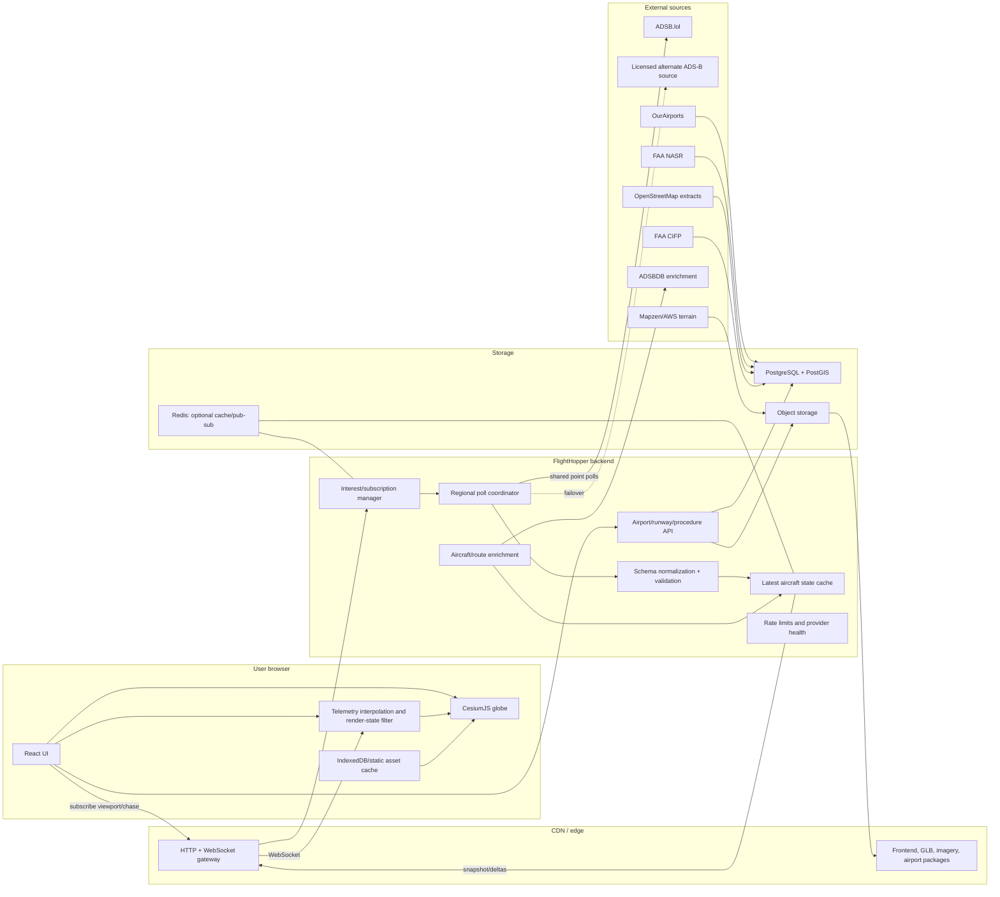

# FlightHopper — Production System Design

**Status:** Proposed  
**Design date:** 2026-09-22  
**Product:** Live global aircraft map with near-real-time third-person chase view  
**Safety classification:** Entertainment and situational awareness only; **not for navigation, flight planning, traffic separation, or operational decision-making**

---

## Executive summary

FlightHopper should use **CesiumJS** for both the global map and immersive chase view, backed by a small provider-agnostic service that polls ADS-B sources, normalizes aircraft state, deduplicates upstream requests, and streams snapshots/deltas to browsers.

The recommended initial data stack is:

- **Live aircraft:** ADSB.lol, subject to written production confirmation.
- **Global airport/runway catalog:** OurAirports.
- **Authoritative US runway overrides:** FAA NASR.
- **Detailed airport geometry:** selectively extracted OpenStreetMap data.
- **Terrain:** Cesium ion during evaluation; Mapzen/AWS terrain through a conversion or custom provider for a free production path.
- **Procedures:** omit from MVP; add FAA CIFP only after runway-following works and the recurring AIRAC ingestion obligations are accepted.
- **Route metadata:** optional enrichment only. Do not make ADSBDB destination data foundational without explicit permission for its route dataset.

The core visual-quality strategy is not to manufacture a perfectly smooth “truth.” It is to:

1. Preserve raw ADS-B observations and their quality metadata.
2. Render at a short delay behind real time, normally 2–4 seconds.
3. Interpolate between valid observations.
4. Extrapolate conservatively for no more than roughly 8 seconds.
5. Clearly show stale, MLAT-derived, or uncertain tracks.
6. Reconcile vertical datums and constrain aircraft to runway elevation only when there is strong evidence that the aircraft is on the ground.

A solo developer can ship an impressive airport-focused MVP without ingesting global air traffic. Production scale requires negotiated provider access or a feeder-backed/raw data relationship; repeated public point queries are not a credible basis for unlimited global coverage.

---

# 1. Goals, scope, and architectural principles

## 1.1 Product goals

FlightHopper must let a user:

1. Browse live aircraft on a globe.
2. select an aircraft without losing context;
3. enter a third-person camera behind and above it;
4. understand speed, altitude, vertical motion, and direction;
5. watch approaches, touchdowns, taxi movement, and departures against geographically correct terrain and runway geometry;
6. recover gracefully when live data becomes late, incomplete, or unavailable.

## 1.2 Non-goals

The initial product is not:

- a certified navigation display;
- an ATC surveillance system;
- a collision-avoidance tool;
- a guaranteed global historical flight database;
- a source of gate, schedule, delay, or filed-flight-plan truth;
- a flight simulator with aerodynamic state;
- a guarantee that heading, pitch, roll, runway assignment, route, or destination is known.

## 1.3 Architectural principles

1. **Truth and presentation remain separate.** Raw observations are retained alongside filtered render state.
2. **Uncertainty is visible.** Staleness, source type, position integrity, and inferred values are represented explicitly.
3. **Upstream polling is shared.** One server poll should serve many users watching the same region.
4. **The browser never becomes coupled to one ADS-B vendor.**
5. **Runway geometry matters before procedures.** A correct runway and terrain produce more visible value than a large library of procedure lines.
6. **Interest-driven ingestion precedes global ingestion.** Query only regions with active viewers until a bulk feed has been negotiated.
7. **Licensing is an architectural constraint.** Every dataset has provenance, version, attribution, and redistribution rules.
8. **No silent dead reckoning.** Extrapolation is short-lived and visibly degraded.

## 1.4 Target service levels

Initial production targets:

- Browser application availability: **99.9% monthly**
- Backend API availability: **99.9% monthly**
- Aircraft update delivery, backend to connected client: **p95 under 500 ms**
- Effective live-data age in healthy coverage: **p50 under 4 s; p95 under 10 s**
- Chase render loop: **60 FPS desktop target; 30 FPS mobile floor**
- Initial region snapshot: **p95 under 2 s**, excluding third-party outage
- Aircraft selection continuity through reconnect: **at least 30 s**
- No indefinite extrapolation
- No incorrect presentation of inferred values as directly observed values

---

# 2. Product UX flow

## 2.1 Browse mode

The application opens in a global or remembered regional view.

### Default presentation

- 2D-style top-down globe orientation, still rendered by CesiumJS.
- Aircraft shown as inexpensive symbols or billboards.
- Clustering at low zoom levels.
- Aircraft labels suppressed until sufficiently zoomed or selected.
- Search by:
  - callsign;
  - ICAO hex;
  - registration when available;
  - airport identifier;
  - geographic location.
- Layer controls:
  - terrain;
  - runway surfaces;
  - airports;
  - trails;
  - procedure overlays, when available;
  - aircraft categories.

### Aircraft marker semantics

Marker color should represent state, not airline branding:

- Green or neutral: recent ADS-B position.
- Amber: MLAT/TIS-B or elevated uncertainty.
- Gray: stale or coasting.
- Cyan outline: selected.
- Ground aircraft: distinct compact marker.
- Emergency squawk: strong alert treatment, but no audible alarm by default.

Do not encode military status as a sensational visual category. If offered, it should be a normal filter with the same uncertainty and ethical caveats as other classifications.

## 2.2 Selection flow

Selecting a marker opens a persistent aircraft panel without immediately moving the camera.

The panel shows:

- callsign or ICAO hex fallback;
- registration and type, when known;
- ground speed;
- barometric altitude;
- geometric altitude, if available;
- vertical rate;
- true track;
- actual heading, if transmitted;
- source type and freshness;
- route enrichment, if licensed and known;
- nearest airport/runway candidate;
- actions: **Follow**, **Chase**, **Recenter**, **Share**.

Every field should distinguish:

- **Observed**
- **Derived**
- **Unknown**
- **Stale**

For example:

- `TRACK 274°T` — observed
- `HDG ~270°T` — estimated from track
- `PITCH +3.1°` — derived
- `DESTINATION UNKNOWN` — not silently guessed

## 2.3 Follow mode

Follow mode keeps the aircraft centered while preserving a top-down or oblique map view.

Behavior:

- User pan or orbit temporarily suspends recentering.
- “Resume follow” returns smoothly.
- Camera range is user-adjustable.
- Selection survives temporary disappearance for 30–60 seconds.
- If the aircraft remains stale, the camera stops coasting and presents a “signal lost” state.

Follow mode is the bridge between browsing and chase mode.

## 2.4 Chase mode

Chase mode places the camera behind and slightly above the aircraft, looking forward along the aircraft’s estimated orientation.

### Entry transition

1. Verify that the selected track has a recent valid position.
2. Preload:
   - aircraft model;
   - terrain around the aircraft;
   - nearby airport/runway geometry;
   - imagery at expected camera level.
3. Animate from the current map camera over approximately 0.8–1.5 seconds.
4. Keep the HUD visible throughout the transition.
5. If terrain or model loading fails, enter chase with a fallback symbol and ellipsoid terrain.

### Chase controls

- Drag: orbit around the aircraft within safe angular limits.
- Scroll/pinch: alter chase distance.
- Double click/tap: reset to canonical chase offset.
- Toggle:
  - locked chase;
  - cinematic damped chase;
  - side view;
  - runway view;
  - cockpit-adjacent view, later.
- Escape/back: return to follow view without deselecting the aircraft.

## 2.5 HUD

The HUD should prioritize legibility over cockpit imitation.

Primary indications:

- **GS:** ground speed in knots
- **ALT BARO:** feet, or `GROUND`
- **ALT GEOM:** feet, optional secondary line
- **AGL:** derived and marked as such when terrain/runway elevation is available
- **VS:** feet per minute
- **TRK:** true ground track
- **HDG:** actual true or magnetic heading only when known; otherwise an estimated marker
- **DATA AGE:** subtle normally, prominent after threshold

Optional:

- callsign;
- aircraft type;
- nearest airport;
- probable runway;
- source: ADS-B, MLAT, TIS-B, other;
- integrity indicator.

### Units

Support:

- Aviation default: kt, ft, ft/min, nautical miles.
- Metric preference: km/h, m, m/s or m/min.
- Direction labels must include `T` or `M` where the reference is known.

Never label `track` as `heading`. Track describes movement over the ground; heading describes nose direction. Crosswind can make them differ materially.

## 2.6 Landing and takeoff experience

Within an airport activation radius—recommended 15 NM and 6,000 ft AGL—the client requests detailed airport data.

The system then:

1. renders runway surfaces and thresholds;
2. raises terrain quality priority;
3. determines candidate runways;
4. shows a subtle runway-identification overlay;
5. optionally presents a predicted ground intercept;
6. blends the aircraft toward runway-constrained ground height only after a valid ground indication or strong multi-signal confidence.

For landing:

- Candidate runway is inferred from alignment, distance to centerline, descent, threshold direction, and proximity.
- The system must not claim “landing runway 27L” as fact unless it has authoritative assignment data. Label it **likely runway**.
- At touchdown, the model should not sink into the terrain or hover tens of metres above it because of mixed vertical datums.

For takeoff:

- Detect an acceleration roll on or near a runway centerline.
- Use runway heading as an orientation stabilizer at very low speed.
- Stop snapping to runway height after a positive climb and clear airborne state.

## 2.7 Camera behavior rules

### Canonical offset

The offset should scale with aircraft dimensions and speed:

- Small aircraft: 30–80 m behind, 10–30 m above.
- Airliner: 80–180 m behind, 25–60 m above.
- High-speed cruise: up to approximately 250 m behind.
- Ground/taxi: 20–60 m behind, 5–15 m above.

A useful rule is:

- chase range = clamp(model length × 4, 50 m, 180 m), with a modest speed term;
- vertical offset = clamp(model height × 3, 12 m, 60 m).

### Damping

Use a critically damped spring or exponential half-life:

- Position half-life: 0.35–0.7 seconds.
- Rotation half-life: 0.25–0.5 seconds.
- User orbit input reduces damping to feel immediate.
- Do not apply spring smoothing to the underlying telemetry—only to camera motion and render orientation.

### Look target

Look slightly ahead of the aircraft rather than directly at its center:

- airborne: 1–3 seconds of estimated forward motion;
- approach: shorter look-ahead to retain runway context;
- ground: aircraft center or short forward offset.

### Horizon and roll

Default camera horizon remains approximately level. Aircraft roll should be visible without forcing the camera to roll equally, which can cause motion sickness. A cinematic mode may apply 10–25% of aircraft roll to the camera.

### Terrain collision

For every camera update:

1. compute desired camera position in the aircraft-local frame;
2. obtain terrain height beneath the desired camera;
3. require a configurable clearance, normally 5–20 m;
4. raise or move the camera closer if it would intersect terrain;
5. smooth correction, except when immediate collision prevention is necessary.

Near cliffs or steep terrain, sample along the line from aircraft to camera, not only at the camera point.

### Data loss

- 0–8 s without a new valid position: conservative extrapolation.
- 8–15 s: stop acceleration/turn inference; coast linearly and fade.
- 15–30 s: freeze at last defensible position; show stale state.
- After 30–60 s: leave chase or keep a frozen “last seen” marker according to user preference.

## 2.8 Desktop considerations

- Full Cesium scene with 3D models.
- Resizable details panel.
- Keyboard shortcuts.
- Multiple labels and optional trails.
- Higher terrain and model LOD.
- WebGL2/WebGPU capability detection, while treating Cesium’s supported rendering path as authoritative.

## 2.9 Mobile considerations

- Default to symbol/billboard mode outside chase.
- Limit active labels and trail lengths.
- Cap device pixel ratio, commonly 1.5–2.
- Reduce terrain screen-space detail.
- Pause rendering when the tab is hidden.
- Use a bottom sheet instead of a side panel.
- Make chase controls one-thumb accessible.
- Offer a “battery saver” mode:
  - 30 FPS target;
  - lower imagery/terrain detail;
  - reduced poll/subscription footprint;
  - no shadows;
  - simplified aircraft model.
- Respect safe areas and browser UI intrusion.
- Locking screen orientation must be optional, not required.

---

# 3. Architecture

## 3.1 Recommended stack

### Frontend

- TypeScript
- React
- Vite or another static application build
- CesiumJS
- Lightweight application state such as Zustand
- TanStack Query for non-streaming metadata
- Web Worker for telemetry filtering when aircraft count warrants it
- IndexedDB for versioned static airport packages and recent user preferences
- glTF/GLB aircraft models with Draco or Meshopt compression where supported

A server-rendered framework is unnecessary for the map itself. A separate lightweight marketing shell can use server rendering if search indexing matters.

### Backend

Recommended initial implementation:

- TypeScript on Node.js
- Fastify or another small HTTP/WebSocket framework
- PostgreSQL with PostGIS for airport/runway metadata
- Redis only when multiple service replicas or cross-instance fan-out are needed
- Object storage plus CDN for:
  - glTF models;
  - airport geometry packages;
  - terrain products;
  - imagery;
  - AIRAC-versioned procedure artifacts.

A single container and PostgreSQL instance are sufficient for MVP. Do not introduce Kafka, Kubernetes, or multiple microservices before actual throughput justifies them.

### Deployment

Initial production:

- Static frontend on CDN.
- One regional backend service with two replicas when availability matters.
- Managed PostgreSQL.
- Optional managed Redis.
- Object storage and CDN.
- Scheduled data-ingestion jobs in the same codebase but separate process type.

## 3.2 Component diagram



## 3.3 Why CesiumJS

### Decision

Use CesiumJS as the primary renderer for browse, follow, and chase modes.

### Rationale

CesiumJS provides:

- globe-native Earth-centered coordinates;
- terrain integration;
- camera reference-frame operations;
- glTF support;
- large-world precision;
- entity and primitive APIs;
- time-dynamic positions;
- 3D Tiles support;
- mature geographic picking and terrain sampling.

CesiumJS is Apache 2.0 and free for commercial and non-commercial use. Cesium ion is a separate hosted product with separate plan restrictions and production pricing; the free Community plan is not a blanket free commercial production tier ([CesiumJS](https://cesium.com/platform/cesiumjs), [ion pricing](https://cesium.com/platform/cesium-ion/pricing/)).

### Alternatives

**MapLibre GL + deck.gl**

Strengths:

- excellent 2D vector maps;
- strong point-layer performance;
- broad basemap ecosystem.

Weaknesses:

- globe chase camera, ellipsoid-relative orientation, terrain collision, and large-world 3D model behavior require substantially more custom work;
- less natural for a behind-aircraft camera close to terrain.

Recommended only if the product becomes primarily a 2D tracker.

**Three.js**

Strengths:

- complete rendering control;
- broad model and effects ecosystem.

Weaknesses:

- requires building globe precision, terrain tiling, geodetic transformations, culling, picking, and map integrations.

Use only for a constrained local-airport scene or if Cesium becomes an unresolvable limitation.

**Babylon.js**

Similar to Three.js: capable engine, but FlightHopper would own much more geospatial infrastructure.

**Dual renderer**

A MapLibre overview plus Cesium chase mode appears attractive but creates duplicated interaction state, camera transitions, styling, terrain, and asset systems. Avoid for the small-team version.

## 3.4 Why a backend is recommended from the beginning

Direct browser calls are acceptable for a private prototype, but not a production architecture.

The backend provides:

- provider abstraction;
- shared polling;
- rate-limit enforcement;
- retry/backoff;
- data validation;
- cache and deduplication;
- consistent timestamps;
- route and aircraft enrichment caching;
- observability;
- downstream WebSocket fan-out;
- the ability to replace a provider without redeploying clients;
- protection against exposing future credentials.

It does not remove upstream licensing requirements. Proxying a public API does not convert it into a licensed bulk feed.

## 3.5 Poll upstream, stream downstream

### Decision

- **Upstream:** HTTP polling, because the cited public ADS-B endpoints are request/response APIs.
- **Downstream:** WebSocket snapshots and deltas.
- **Fallback:** client REST polling if WebSocket is unavailable.

A WebSocket to the browser improves fan-out and avoids every client polling independently. It does not improve source freshness beyond the upstream poll interval.

### Initial update cadence

- Browse region: 3–5 seconds.
- Selected/chase aircraft: 1–2 seconds when provider policy and budget permit.
- Ground movement near airports: 1–2 seconds.
- Background or low-power client: 5–10 seconds.

If only a 10-second source is available, the UI must adapt its claims and extrapolation limits rather than conceal the limitation.

## 3.6 External API surface

### WebSocket connection

`GET /v1/live`

Client subscribe message:

```json
{
  "type": "subscribe",
  "requestId": "uuid",
  "mode": "viewport",
  "bbox": [-123.2, 37.1, -121.5, 38.2],
  "maxAircraft": 2000,
  "detail": "summary"
}
```

Chase subscription:

```json
{
  "type": "subscribe",
  "requestId": "uuid",
  "mode": "chase",
  "icao24": "a1b2c3",
  "airportRadiusNm": 15
}
```

Server snapshot:

```json
{
  "type": "snapshot",
  "subscriptionId": "uuid",
  "sequence": 1402,
  "generatedAt": "2026-09-22T12:00:04.250Z",
  "providerAgeMs": 1200,
  "aircraft": []
}
```

Server delta:

```json
{
  "type": "delta",
  "subscriptionId": "uuid",
  "sequence": 1403,
  "generatedAt": "2026-09-22T12:00:06.102Z",
  "upsert": [],
  "remove": ["a1b2c3"]
}
```

The client detects sequence gaps and requests a new snapshot.

### REST resources

- `GET /v1/aircraft/{icao24}`
- `GET /v1/airports?bbox=...`
- `GET /v1/airports/{ident}`
- `GET /v1/airports/{ident}/geometry`
- `GET /v1/airports/{ident}/procedures?cycle=...`
- `GET /v1/health/providers`
- `GET /v1/data-attribution`

Responses include `ETag`, source provenance, dataset version, and effective dates.

## 3.7 Deployment evolution

### Stage A: single service

One process owns active regional polls, normalized state, and WebSocket sessions.

### Stage B: replicated service

- Redis lease per poll cell.
- Redis pub/sub or Streams for aircraft deltas.
- Sticky sessions optional but unnecessary if subscriptions are reconstructible.
- PostgreSQL remains the metadata system of record.

### Stage C: negotiated bulk feed

Split into:

1. Feed adapter
2. Normalizer/state processor
3. Spatial interest router
4. WebSocket gateways
5. Static aeronautical-data pipeline

Only introduce a durable event log if replay, auditing, or multiple independent consumers require it.

---

# 4. Data plane

## 4.1 ADS-B source strategy

### Primary recommendation

Use ADSB.lol for the MVP, but contact the operator before a public production launch.

Its documented API:

- permits free access at present;
- has dynamic rate limits;
- may require feeder-derived credentials in the future;
- asks production users to make contact;
- licenses public API/data under ODbL;
- supports point queries up to 250 NM ([API documentation](https://api.adsb.lol/docs), [open-data API page](https://www.adsb.lol/docs/open-data/api/)).

This is appropriate for an MVP but not a guaranteed commercial SLA.

### Secondary sources

**OpenSky**

Not a default production fallback. Its current terms state that operational REST integration and commercial use require a written agreement. Anonymous retrieval should be no faster than every 10 seconds, and OAuth2 client credentials are used for authenticated programmatic access ([terms](https://opensky-network.org/about/terms-of-use), [API documentation](https://openskynetwork.github.io/opensky-api/index.html)).

**Airplanes.live**

Potential negotiated production source. Public interfaces are not a substitute for commercial access; production/commercial users should arrange credentials ([commercial access](https://airplanes.live/commercial-use/)).

**ADSB.fi**

Treat bot protection and undocumented access constraints as a sign that it should not be integrated without an explicit agreement.

**Own receiver**

A valuable local-airport enhancement. A local readsb feed gives excellent low-latency coverage where the receiver can see the aircraft, but cannot provide global service.

## 4.2 Interest-driven regional polling

Public point endpoints should be queried according to active user interest.

### Spatial partitioning

Represent active interest using fixed cells, such as H3 or S2. Group adjacent cells into provider queries whose circles cover the active area.

Rules:

- Deduplicate overlapping user viewports.
- Quantize viewport subscriptions to stable cells to prevent poll churn.
- Add a small boundary overlap to avoid missing aircraft crossing cells.
- Deduplicate aircraft by ICAO hex after combining responses.
- Track the freshest valid observation per field, not merely per record.
- Stop polling a cell after a short idle grace period, such as 30 seconds.
- Enforce a global upstream request budget.

### Important limit

A point-query API is not a global feed. Do not attempt to cover Earth by continuously polling a mesh of 250 NM circles. Global continuous ingestion requires a negotiated bulk source or feeder relationship.

## 4.3 Normalized aircraft schema

```text
AircraftState
  identity
    icao24: string
    callsign?: string
    registration?: string
    aircraftType?: string
    category?: string
  observation
    provider: string
    providerTimestamp: instant
    receivedAt: instant
    positionTimestamp?: instant
    sourceType: adsb | mlat | tisb | mode_s | other
  position
    latitudeDeg: number
    longitudeDeg: number
    altitudeBaroFt?: number
    altitudeGeomFt?: number
    onGround?: boolean
  motion
    groundSpeedKt?: number
    trackTrueDeg?: number
    headingTrueDeg?: number
    headingMagDeg?: number
    verticalRateBaroFpm?: number
    verticalRateGeomFpm?: number
    trackRateDegPerSec?: number
    rollReportedDeg?: number
  quality
    seenSec?: number
    seenPositionSec?: number
    nic?: number
    nacP?: number
    nacV?: number
    sil?: number
    rcMeters?: number
    positionValid: boolean
  status
    squawk?: string
    emergency?: string
    stale: boolean
  provenance
    rawRecordVersion: string
    inferredFields: string[]
```

All upstream fields are optional unless the normalizer has verified them. Numeric zero must not be confused with missing data.

## 4.4 Time normalization

For each response:

- Capture monotonic request start/end.
- Capture local UTC receipt time.
- Use provider response time if supplied.
- Derive position time as `providerNow - seen_pos`.
- Derive general message time as `providerNow - seen`.
- Reject implausible future timestamps.
- Record clock-offset observations separately.

Interpolation must use position observation time, not HTTP receipt time.

## 4.5 ADS-B field semantics

Common v2 fields include:

- `alt_baro`: pressure/barometric altitude in feet or literal `"ground"`;
- `alt_geom`: GNSS/INS geometric altitude;
- `gs`: ground speed in knots;
- `track`: true ground track;
- `true_heading`: heading relative to true north;
- `mag_heading`: heading relative to magnetic north;
- `nav_heading`: selected autopilot heading, usually magnetic but not guaranteed;
- `baro_rate` and `geom_rate`;
- `seen` and `seen_pos`;
- `nic`, `nac_p`, `nac_v`, `sil`, and containment radius fields.

Do not use `nav_heading` as aircraft orientation. It is a selected target, not necessarily the nose direction.

## 4.6 Position filtering and interpolation

### Rendering timeline

Render at:

`displayTime = currentTime - interpolationDelay`

Recommended interpolation delay:

- good 1–2 second source: 2–3 seconds;
- irregular or 5-second source: 4–6 seconds;
- user-selectable “low latency” mode may shorten this while warning that motion can become less stable.

### Filter stages

1. **Validation**
   - coordinate range;
   - field types;
   - plausible altitude and speed;
   - observation age;
   - source integrity.
2. **Outlier rejection**
   - impossible implied speed;
   - unrealistic vertical displacement;
   - large jump combined with poor quality;
   - identity collision or ICAO reuse evidence.
3. **Coordinate conversion**
   - geodetic to Earth-centered Earth-fixed coordinates.
4. **State estimation**
   - constant-velocity alpha-beta filter for MVP;
   - constant-turn-rate/velocity Kalman model later, if measurements justify it.
5. **Interpolation**
   - linear or cubic Hermite interpolation using bounded velocity;
   - no unconstrained high-degree spline.
6. **Short extrapolation**
   - use ground speed, track, and vertical rate;
   - maximum around 8 seconds.
7. **Visual damping**
   - separate camera and model-orientation smoothing.

Cesium’s `SampledPositionProperty` supports interpolation and bounded extrapolation, but a custom `CallbackProperty` or render-state function provides tighter control over rejection, coasting, and mixed altitude sources. Cesium extrapolation duration must never be left unlimited ([SampledPositionProperty](https://cesium.com/learn/cesiumjs/ref-doc/SampledPositionProperty.html)).

### Discontinuity handling

Snap rather than interpolate when:

- identity appears to teleport;
- implied speed exceeds a configured aircraft-class threshold;
- longitude wraps;
- provider source changes with incompatible timing;
- an aircraft reappears after a long gap.

The camera transition may still be damped so that a necessary model snap does not produce a violent view change.

## 4.7 MLAT and quality handling

MLAT positions can be noisier and less frequent than direct ADS-B.

Policy:

- preserve `sourceType`;
- increase interpolation delay;
- use stricter outlier rejection;
- shorten extrapolation;
- display uncertainty;
- avoid runway snapping based solely on a noisy MLAT point;
- avoid deriving fine-grained roll or touchdown timing from low-integrity tracks.

Use NIC/NACp/SIL or containment radius when available. A simple quality tier is more useful to users than raw avionics codes:

- **High:** recent direct ADS-B with strong integrity.
- **Medium:** recent direct ADS-B with limited integrity metadata.
- **Low:** MLAT/TIS-B, stale position, or poor containment.
- **Unknown:** insufficient quality information.

## 4.8 Altitude and vertical datum policy

This is a critical correctness area.

### Distinct altitude concepts

- Barometric altitude is pressure-derived and depends on pressure reference.
- Geometric altitude is generally relative to the WGS84 ellipsoid.
- Runway elevations are normally mean-sea-level/orthometric.
- Terrain datasets may use an orthometric datum such as EGM96 or another source-specific vertical reference.
- Cesium Cartesian conversion expects ellipsoidal height.

These values cannot be mixed as if they share one zero surface.

### Display policy

- Show barometric altitude as the principal aviation indication.
- Show geometric altitude separately when available.
- Label AGL as derived.
- Preserve raw values in details/debug views.
- Never silently call geometric altitude “MSL.”

### Render-height policy

1. If a recent, credible geometric altitude exists, use it as the primary airborne Cesium height.
2. If only barometric altitude exists:
   - treat it as approximate orthometric/MSL-like altitude;
   - add local geoid undulation to obtain an ellipsoid-compatible render height;
   - mark the render height as approximate.
3. Near the ground:
   - compute local terrain/runway ellipsoid height;
   - when `onGround` or `alt_baro == "ground"` and the aircraft is spatially consistent with a runway/taxi surface, render at surface height plus model gear offset;
   - blend into this constraint over a short interval.
4. Do not apply ground constraints to an uncertain airborne track merely because one altitude sample is low.

The global relationship is approximately `H = h − N`, where `H` is orthometric height, `h` is ellipsoidal height, and `N` is geoid undulation. EGM2008 grids are available from NGA, while NOAA VDatum supports transformations among vertical datums ([NGA EGM2008](https://earth-info.nga.mil/index.php?action=egm2008&dir=gravity), [NOAA VDatum](https://vdatum.noaa.gov/)).

## 4.9 Track, heading, pitch, and roll

### Yaw

Orientation precedence:

1. recent true heading;
2. recent magnetic heading converted with a dated magnetic model;
3. true ground track;
4. derivative of recent position;
5. last valid orientation.

Selected `nav_heading` must not be used as actual orientation.

### Pitch

Estimate from horizontal and vertical velocity:

`pitch = atan2(vertical speed, horizontal speed)`

Constraints:

- only when both velocities are credible;
- heavily smooth noisy vertical rates;
- clamp to plausible display limits;
- set near zero on the ground;
- avoid pitch inference at very low ground speed.

### Roll

Precedence:

1. reported roll;
2. estimate from turn rate and speed:
   `bank ≈ atan(v × yawRate / g)`;
3. zero.

Clamp estimated roll, initially ±25° or ±30°, and smooth it. This produces a plausible visualization, not measured attitude.

### Crosswind limitation

When heading is unavailable, orienting the model along track hides crab angle. The UI should label this as estimated orientation rather than imply true nose direction.

## 4.10 Route enrichment

ADSBDB can identify callsign routes, but its repository explicitly states that the flight-route data may not be copied, published, or incorporated into another database without permission from the named data owner. The software’s MIT license does not erase those dataset restrictions ([ADSBDB repository](https://github.com/mrjackwills/adsbdb)).

Therefore:

- do not ship persistent ADSBDB route caching or public redistribution without permission;
- treat route as optional enrichment;
- cache only according to an agreed policy;
- do not use destination as the sole basis for loading approach procedures;
- expect callsign reuse, diversions, positioning flights, and stale schedules.

A route can narrow airport candidates, but live trajectory must determine runway/procedure plausibility.

---

# 5. 3D globe and chase implementation

## 5.1 Aircraft rendering layers

Use three LODs:

1. **Far:** GPU point primitive or billboard.
2. **Medium:** oriented icon or very simple mesh.
3. **Near/selected:** glTF aircraft model.

Only the selected aircraft and a small nearby set should use high-detail models.

## 5.2 Entity versus primitive model

For MVP:

- Cesium Entity for selected aircraft, path, labels, and interactive objects.
- `PointPrimitiveCollection` or billboard collection for the general fleet.
- Ground/runway polygons may use entities initially.

At scale:

- batch static airport geometry into 3D Tiles or compact binary packages;
- use primitive collections for thousands of aircraft;
- avoid a React component per aircraft and avoid rebuilding Cesium objects every render.

React should control scene lifecycle and selection state, not mirror the entire Cesium object graph declaratively.

## 5.3 glTF conventions

Every model asset needs metadata:

- ICAO type mapping;
- length, span, height;
- origin location;
- nose-axis convention;
- up-axis correction;
- landing-gear vertical offset;
- bounding radius;
- default scale;
- LOD variants;
- license and attribution.

Normalize assets offline so runtime transforms remain consistent. Unknown types use a generic narrow-body or generic light-aircraft model based on category, never a misleading exact type.

## 5.4 Orientation frame

Construct aircraft orientation in the local east-north-up frame at its current geodetic position.

Apply:

1. yaw around local up;
2. pitch around local right;
3. roll around local forward;
4. static correction for the glTF model’s intrinsic forward/up axes.

Avoid performing orientation directly in global axes.

## 5.5 Chase camera transform

The camera should use the aircraft-local reference frame or an equivalent computed transform. Cesium supports `lookAtTransform` for positioning a camera relative to a reference frame ([Camera documentation](https://cesium.com/learn/cesiumjs/ref-doc/Camera.html)).

The camera controller maintains:

- desired target position;
- desired orientation;
- desired offset;
- collision-corrected offset;
- actual damped camera state;
- user orbit offset.

The camera should not be rigidly parented to every telemetry jitter.

## 5.6 Terrain choice

### Evaluation path

Use Cesium World Terrain during personal/evaluation development if its account terms fit. Do not assume the free ion tier permits commercial production.

### Free production path

Mapzen Terrain Tiles remain available through AWS Open Data, including Terrarium PNGs through zoom 15. Terrarium encodes metres as:

`height = R × 256 + G + B / 256 − 32768`

([AWS dataset](https://registry.opendata.aws/terrain-tiles/), [format documentation](https://github.com/tilezen/joerd/blob/master/docs/formats.md)).

However, these PNG tiles are not automatically a Cesium quantized-mesh endpoint.

Recommended options:

1. **Preconvert selected regions to quantized mesh** and serve a Cesium-compatible `layer.json` hierarchy.
2. **Implement a `TerrainProvider`/`CustomHeightmapTerrainProvider` adapter** that fetches, decodes, and resamples Terrarium tiles.
3. **Use a paid Cesium terrain service** when engineering and hosting cost exceed subscription cost.

For a small team, begin with a custom adapter or limited regional conversion. Validate tile scheme, edge continuity, vertical datum, CORS, attribution, and performance. Cesium’s custom heightmap provider has fewer features than a complete quantized-mesh provider, including limitations around normals, water masks, and availability ([CustomHeightmapTerrainProvider](https://cesium.com/learn/cesiumjs/ref-doc/CustomHeightmapTerrainProvider.html)).

### Imagery

Use a layered strategy:

- Natural Earth raster for low zoom; its own raster/vector products are public domain ([terms](https://www.naturalearthdata.com/about/terms-of-use/)).
- A properly licensed imagery or map-tile provider for operational zoom levels.
- OSM-derived tiles only under the relevant usage policy and attribution.
- Do not depend on donated OSM tile infrastructure for uncontrolled high-volume use; self-host or contract a provider as usage grows ([OSM vector tile policy](https://operations.osmfoundation.org/policies/vector/)).

## 5.7 Shadows and atmosphere

- Disable dynamic shadows by default on mobile.
- Enable terrain lighting and model shadows only in high-quality mode.
- Use Cesium atmosphere conservatively.
- Do not let visual effects obscure runway geometry or HUD information.

---

# 6. Airport, runway, and approach realism

## 6.1 Data-source hierarchy

### Global baseline: OurAirports

OurAirports provides daily CSV exports and releases its data to the public domain. Runway records include endpoint coordinates, endpoint elevations, dimensions, surfaces, identifiers, headings, lighting, closure state, and displaced thresholds when known ([data](https://ourairports.com/data/), [dictionary](https://ourairports.com/help/data-dictionary.html)).

Use it for:

- airport search;
- global runway baseline;
- nearest-airport lookup;
- initial runway rectangles;
- airport activation bounds.

Its lack of warranty and community-maintained nature means it should not override a more authoritative current national source.

### US authoritative overlay: FAA NASR

FAA NASR publishes 28-day airport datasets. Current CSV products separate runway-level and runway-end fields, including physical endpoints, displaced thresholds, endpoint elevations, and related approach information ([NASR subscription](https://www.faa.gov/air_traffic/flight_info/aeronav/Aero_Data/NASR_Subscription/)).

For US airports:

- NASR overrides conflicting OurAirports runway geometry.
- Store effective cycle.
- Reject a cycle if completeness or relational integrity checks fail.
- Retain the prior valid cycle for rollback.

### Detailed geometry: OpenStreetMap

OSM can supply:

- runway and taxiway geometry;
- aprons;
- terminals;
- hangars;
- airport boundaries;
- selected building footprints.

Use regional extracts, not live Overpass calls for every user. OSM data is ODbL and requires attribution and share-alike handling for derivative databases ([aeroway model](https://wiki.openstreetmap.org/wiki/Aeroways), [ODbL guidance](https://wiki.openstreetmap.org/wiki/Legal_FAQ/ODbL)).

Keep the OSM-derived airport geometry dataset as a separately versioned layer where practical. Do not casually merge it into a proprietary master database without reviewing ODbL consequences.

### X-Plane apt.dat

X-Plane apt.dat contains richer runway, taxiway, marking, lighting, and airport-furniture data, and its specification describes GPL redistribution obligations ([apt.dat specification](https://developer.x-plane.com/article/airport-data-apt-dat-file-format-specification/)).

It is useful, but not the first recommendation because:

- GPL provenance must be isolated and preserved;
- scenery-pack and source-data terms require verification;
- combining it into browser-delivered proprietary geometry may create avoidable licensing complexity.

Consider it later for airport visual enhancement after legal review.

## 6.2 Canonical airport model

```text
Airport
  id
  identifiers: ICAO, IATA, local
  name
  referencePoint
  elevation
  bounds
  timezone
  sources[]
  effectiveFrom
  effectiveTo

Runway
  id
  airportId
  designators
  width
  surface
  closed
  lighted
  lowEnd
    physicalEnd
    displacedThreshold
    elevation
    trueHeading
  highEnd
    physicalEnd
    displacedThreshold
    elevation
    trueHeading
  source
  sourcePriority
  effectiveCycle

AirportFeature
  type: taxiway | apron | terminal | hangar | marking | other
  geometry
  properties
  source
  sourceVersion
```

All numeric fields include units in the schema or have canonical documented units.

## 6.3 Runway surface construction

Given two physical runway endpoints and width:

1. Transform endpoints into a local ENU plane.
2. Calculate the centerline direction.
3. Offset half-width to each side.
4. Construct a polygon with stable winding.
5. Add:
   - displaced-threshold markings;
   - runway designators;
   - centerline;
   - edge markings;
   - optional touchdown-zone and aiming-point markings.
6. Assign each vertex a surface elevation.

For sloping runways, interpolate between endpoint elevations. For airports with high-quality polygon data, prefer actual outlines.

## 6.4 Terrain draping and z-fighting

A runway should not simply be clamped to a coarse terrain mesh:

- terrain can undulate across an engineered runway;
- imagery may already show the runway;
- coplanar geometry can flicker.

Recommended hierarchy:

1. Use authoritative endpoint elevations to define a planar or gently sloped runway surface.
2. Render slightly above terrain—centimetres to decimetres, not metres.
3. Use depth/polygon offset or classification techniques where appropriate.
4. Blend runway shoulders into terrain visually.
5. Do not modify global terrain geometry in MVP.

High-fidelity airport terrain flattening is a later 3D Tiles or custom terrain-processing feature.

## 6.5 Candidate runway inference

For each aircraft within the airport activation volume, score runway ends:

```text
score =
  alignmentWeight × headingAlignment
  + centerlineWeight × lateralAlignment
  + thresholdWeight × forwardDistance
  + descentWeight × verticalConsistency
  + airportWeight × routeOrNearestAirportPrior
  + persistenceWeight × previousCandidate
```

Hard rejection criteria:

- runway closed;
- aircraft moving away beyond tolerance;
- approach intercept behind aircraft;
- excessive cross-track distance;
- incompatible altitude/descent profile.

Use hysteresis so the probable runway does not switch every update.

Labels:

- `LIKELY RWY 27L`
- `RUNWAY CANDIDATE`
- never `CLEARED TO LAND` or other operational language.

## 6.6 Approach procedure overlays

### Recommendation

Procedures are **not required for MVP**.

They add:

- ARINC 424 parsing complexity;
- leg-type semantics;
- RF arcs and path terminators;
- magnetic variation handling;
- procedure/version validity;
- recurring AIRAC updates;
- legal/error-notification obligations;
- a risk of visually implying that the aircraft is assigned to a published procedure.

### FAA CIFP

FAA CIFP is raw ARINC 424 version 18 data and updates every 28 days. The FAA does not provide the full ARINC 424 data dictionary; that specification must be obtained separately. Downloaders accept an error-notification agreement requiring downstream notification of reported errors ([CIFP](https://www.faa.gov/air_traffic/flight_info/aeronav/digital_products/cifp/), [download](https://www.faa.gov/air_traffic/flight_info/aeronav/digital_products/cifp/download/)).

### Procedure pipeline

When introduced:

1. Download the upcoming cycle.
2. Verify archive checksum and expected file structure.
3. Parse into a staging schema.
4. Validate:
   - record counts;
   - airport identifiers;
   - fix references;
   - leg continuity;
   - coordinate ranges;
   - supported path terminators.
5. Resolve magnetic variation and altitude/speed constraints.
6. Generate display-only polylines.
7. Run geometric regression tests on known procedures.
8. Activate at the cycle’s effective time.
9. Retain prior and next cycle for rollback/preview.
10. Publish a cycle identifier and “not for navigation” label.

Initially support common path terminators only and explicitly flag unsupported legs. Do not connect discontinuous legs with invented straight lines.

## 6.7 Procedure matching

Destination lookup alone is insufficient.

A plausible procedure match combines:

- destination prior;
- aircraft proximity;
- sequence of recent track points;
- procedure-leg geometry;
- direction;
- altitude constraints as weak evidence;
- continuity over time.

Even then, label it “possible approach” rather than assigned procedure.

## 6.8 MVP versus later

### Must have for MVP

- correct runway endpoints and widths;
- runway elevation;
- terrain;
- low-altitude datum handling;
- probable-runway inference;
- stable chase camera;
- ground-state constraint;
- source/freshness indication.

### Later

- taxiways, aprons, and terminals;
- detailed markings and lighting;
- OSM buildings;
- terrain flattening;
- CIFP overlays;
- matched procedure progress;
- photorealistic airport assets.

---

# 7. Performance and scale

## 7.1 Client budgets

Suggested desktop scene budgets:

- 5,000–15,000 visible point aircraft depending on hardware;
- under 200 medium-detail aircraft;
- under 20 detailed models;
- one highest-detail selected model;
- bounded trail samples per aircraft;
- airport geometry loaded only within activation range.

Mobile budgets should be one quarter to one half of these.

## 7.2 Viewport culling

Cull by:

- camera frustum;
- horizon;
- altitude-dependent distance;
- subscription bounding region;
- label importance;
- selected status.

Do not render or subscribe to the back side of the globe.

## 7.3 Aircraft LOD

Example thresholds:

- greater than 100 km or tiny screen projection: points only;
- 10–100 km: billboard/oriented icon;
- under 10 km: simple model for limited nearest set;
- selected/chased: detailed model independent of distance;
- ground airport mode: stricter local selection to avoid hundreds of models.

Use screen-space size rather than only physical distance where possible.

## 7.4 Update and render separation

- Network ingest: 1–5 Hz depending on mode.
- State filter: on incoming samples.
- Render interpolation: every animation frame.
- HUD text: 5–10 Hz is sufficient.
- React UI updates: avoid 60 Hz state propagation.
- Cesium object mutation: direct controlled scene adapter.

## 7.5 Static geometry distribution

For early releases:

- one compact airport geometry response per activated airport;
- gzip or Brotli;
- long-lived immutable URLs containing data version;
- IndexedDB/browser cache.

At larger scale:

- regional 3D Tiles;
- PMTiles or similar range-addressable archives for OSM-derived vectors;
- CDN edge caching.

## 7.6 Backend capacity model

Let:

- `U` = concurrent users;
- `C` = unique active spatial cells;
- `P` = upstream poll interval;
- `A` = average aircraft per active cell.

Without deduplication, upstream request rate is approximately `U/P`.

With shared regional polling, it is approximately `C/P`.

For 10,000 users concentrated around 100 airports, shared polling can reduce thousands of requests per second to tens. For 10,000 users spread globally, `C` can approach `U`; public point APIs then cease to be viable.

## 7.7 Rate limiting and backpressure

### Provider-facing

- Token bucket per provider.
- Respect `Retry-After`.
- Exponential backoff with jitter.
- Circuit breaker after persistent failure.
- Prioritize:
  1. selected aircraft;
  2. active airport chase regions;
  3. ordinary viewports;
  4. speculative prefetch.

### Client-facing

- Per-IP and per-session limits.
- Maximum subscription area and aircraft count.
- Debounce viewport changes.
- Require explicit global-low-detail mode rather than accepting a world-sized high-detail viewport.
- Disconnect clients that continually submit malformed or rapidly changing subscriptions.

### Degraded mode

When upstream capacity is constrained:

- lengthen browse poll interval;
- preserve chase subscriptions;
- reduce enrichment;
- send a server status message;
- never falsely repeat old samples as new.

## 7.8 Caching

- Latest aircraft state: in memory, TTL 60–120 seconds.
- Provider response cells: no longer than the effective update interval.
- Aircraft metadata: days to weeks, subject to source terms.
- Negative metadata lookups: short TTL.
- Airport/runway data: immutable by dataset cycle.
- Route data: only under licensed caching rules.
- Terrain and imagery: according to source cache headers and licenses.

## 7.9 Multi-region considerations

Do not deploy multi-region ingestion initially.

When needed:

- elect one poll owner per spatial cell;
- publish normalized updates to interested regions;
- terminate WebSockets near users;
- keep static airport/terrain assets on a global CDN;
- use regional failover without duplicate uncontrolled upstream polling.

## 7.10 Observability

Metrics:

- upstream request rate/status/latency;
- provider rate-limit responses;
- active cells and subscriptions;
- aircraft per response;
- observation age;
- normalization rejection reason;
- WebSocket connections and send queue depth;
- snapshot/delta size;
- sequence-gap rate;
- terrain/airport asset failures;
- chase FPS and client long tasks;
- stale-track percentage;
- candidate-runway confidence distribution.

Logs:

- structured;
- no unnecessary user location retention;
- provider request correlation ID;
- dataset version;
- no credentials;
- sampled aircraft records only in controlled debugging.

Alerts:

- provider 429/5xx surge;
- median observation age above target;
- zero aircraft from normally active regions;
- failed AIRAC/NASR ingestion;
- WebSocket queue growth;
- database or cache saturation.

---

# 8. Reliability, security, and data governance

## 8.1 Failure modes

### ADS-B provider unavailable

- Hold last state briefly.
- Stop extrapolating at limit.
- Show provider degradation.
- Fail over only to a source whose license and update behavior are configured.
- Do not merge incompatible source timestamps without normalization.

### Terrain unavailable

- Fall back to cached tiles or ellipsoid.
- Disable AGL and terrain-collision claims when no valid surface is available.
- Keep runway polygons visible if their elevation is known.

### Airport geometry unavailable

- Render terrain only.
- Suppress runway inference.
- Keep chase functioning.

### Enrichment unavailable

- Callsign/ICAO identity remains.
- Route, owner, photo, and exact model become unavailable.
- Live tracking must not depend on enrichment.

### WebSocket interruption

- Reconnect with exponential backoff.
- Resubscribe.
- Request a full snapshot.
- Do not apply deltas across a sequence gap.

## 8.2 Security controls

- TLS everywhere.
- Fixed allowlist of upstream hosts; no user-supplied proxy URLs.
- Strict upstream response size and timeout limits.
- JSON schema validation.
- WebSocket origin validation.
- CORS restricted to owned domains.
- Per-IP/session limits.
- Content Security Policy.
- Subresource and dependency integrity practices.
- No provider secrets in browser bundles.
- Sanitized labels and metadata before DOM rendering.
- Signed or versioned static asset manifests.
- Software bill of materials and automated dependency scanning.
- Administrative ingestion endpoints isolated from the public API.

## 8.3 Privacy

Minimize collection of:

- user IP retention;
- exact viewed locations;
- aircraft watch history;
- share-link access history.

Recommended defaults:

- coarse aggregate analytics;
- short operational log retention;
- no account required for core viewing;
- private watchlists if accounts are added;
- explicit consent for telemetry analytics.

## 8.4 Dataset registry

Maintain a machine-readable registry with:

- dataset name;
- source URL;
- license;
- attribution text;
- effective version/cycle;
- acquired timestamp;
- checksum;
- allowed uses;
- redistribution constraints;
- retention policy;
- contact/approval record;
- transformation pipeline version.

A build or deployment should fail if required attribution or provenance is absent.

---

# 9. Legal, terms, attribution, and ethics

This section is an engineering risk assessment, not legal advice. Production launch should receive qualified legal review.

## 9.1 ADSB.lol

Known constraints:

- Public API currently free.
- Dynamic rate limits.
- Future feeder/API-key requirement is contemplated.
- Production users are asked to contact the operator.
- Public API/data identified as ODbL.
- Data is provided without accuracy guarantees.
- Endpoints include LADD, PIA, and military categories.

Actions:

1. Contact ADSB.lol before public production use.
2. Confirm acceptable request rate and caching.
3. Confirm attribution text.
4. Determine whether FlightHopper’s normalized and cached aircraft database is a derivative database under ODbL.
5. Prepare an ODbL compliance path, including any required database offer/share-alike.
6. Implement provider removal and failover without a client release.

Relevant references: [API](https://api.adsb.lol/docs), [privacy and license](https://www.adsb.lol/privacy-license/).

## 9.2 OpenSky

Do not assume that “free account” means production permission. Current terms require written permission for operational integration and commercial use. Use only after receiving suitable rights.

## 9.3 ADSBDB

Separate:

- MIT-licensed server software;
- restrictions attached to route data.

Do not copy, persist, or republish route data without explicit permission. If permission cannot be obtained, omit route enrichment or replace it with a source whose licensing supports the product.

## 9.4 OurAirports

Public domain with no accuracy or fitness warranty. Attribution is appreciated but not required. Display credit anyway because it improves provenance transparency.

## 9.5 OpenStreetMap

Requirements include:

- visible `© OpenStreetMap contributors`;
- link to copyright/license information;
- ODbL treatment for derivative databases;
- compliance with tile-server usage policies.

Using OSM data does not automatically permit heavy use of OSM-hosted tiles. Dataset rights and hosted-service capacity are separate concerns.

## 9.6 Mapzen/AWS terrain

The AWS Open Data listing provides public access, but terrain tiles combine underlying source datasets. Implement the attribution chain documented by the dataset; do not infer that “open AWS bucket” means attribution-free or uniformly licensed.

## 9.7 FAA NASR and CIFP

US federal datasets are generally public domain, but:

- current-cycle discipline matters;
- data must be labeled not for navigation in this product;
- CIFP download includes an error-notification agreement;
- CIFP requires recurring cycle management;
- the ARINC 424 specification is not supplied free with CIFP;
- modified data must not imply FAA certification or endorsement.

The application should always display:

> For entertainment and situational awareness only. Not for navigation.

## 9.8 Cesium

- CesiumJS: Apache 2.0.
- Cesium ion services and hosted datasets: separate commercial terms, quotas, and attribution.
- glTF aircraft models: each asset requires its own license record.
- Do not ship copied manufacturer or airline trademarks without rights.

## 9.9 Aircraft privacy and ethics

ADS-B radio broadcasts may be publicly receivable, but aggregation changes practical exposure.

Recommended policy:

- No owner home-address information.
- No person-focused watchlists by default.
- No notifications framed around individual private travel.
- No historical dossiers in MVP.
- Do not market military tracking as operational intelligence.
- Apply a modest delay or suppress sensitive categories where legally or ethically warranted.
- Provide a documented abuse/reporting process.
- Preserve source uncertainty: military, PIA, and LADD classification may be incomplete.
- Never claim FlightHopper defeats privacy programs.
- Consider disabling shareable deep links for aircraft explicitly associated with heightened personal-risk cases.

The product can remain open-data-friendly without maximizing individual traceability.

## 9.10 Attribution UI

Provide:

- persistent compact attribution in the globe;
- expanded **Data & Licenses** panel;
- dataset version/effective date;
- direct source and license links;
- aircraft-state provider attribution;
- terrain and imagery attribution;
- model author/license;
- downloadable notices where required.

Attribution must remain visible in screenshots or embeds when the source requires it.

---

# 10. Delivery roadmap

## Phase 0 — Technical proof

**Duration:** 1–2 weeks

### Scope

- CesiumJS globe.
- One ADSB.lol point query from a development proxy.
- Generic aircraft marker.
- Select and chase one aircraft.
- Minimal HUD.
- No route enrichment.
- Ellipsoid or evaluation terrain.
- Raw source-age display.

### Acceptance criteria

- A selected aircraft moves continuously between source observations.
- Chase camera remains behind the aircraft during straight and turning flight.
- Track is not labeled heading.
- Extrapolation stops after a fixed limit.
- The UI survives missing optional fields.
- No provider credential or URL logic is embedded irreversibly in the client.

### Exit risk

If the chase experience is not compelling with real, irregular telemetry, do not build procedures or global infrastructure yet.

---

## MVP — Impressive airport chase

**Duration:** 4–8 additional weeks

### Scope

- React/TypeScript/CesiumJS application.
- Backend provider adapter and normalized schema.
- Upstream regional polling.
- Downstream WebSocket.
- Browse, select, follow, and chase.
- HUD:
  - ground speed;
  - barometric/geometric altitude;
  - vertical rate;
  - track;
  - heading only when valid;
  - freshness/source.
- Short-delay interpolation and bounded extrapolation.
- Generic aircraft model categories.
- OurAirports runway data.
- FAA NASR runway overrides for US airports.
- Terrain around target launch airports.
- Runway polygons, threshold labels, and centerlines.
- Probable-runway inference.
- Mobile reduced-quality mode.
- Attribution and safety labeling.
- Instrumentation for data age, frame rate, and provider errors.

### Recommended launch geography

Curate 5–20 visually compelling airports:

- coastal;
- mountainous;
- dense metropolitan;
- parallel-runway;
- steep or scenic approaches.

The live aircraft feed can remain broadly viewable, while enhanced airport geometry is curated.

### Acceptance criteria

1. Browse view displays at least 1,000 aircraft at 30 FPS on a mid-range laptop.
2. Chase view sustains 60 FPS desktop and at least 30 FPS on a target modern phone.
3. Normal 2-second source updates appear smooth with no unbounded spline overshoot.
4. No extrapolation continues beyond 8 seconds.
5. Stale state becomes visible by 10–15 seconds.
6. Camera never enters known terrain during a predefined mountain-approach test set.
7. Runway endpoints align within:
   - 10 m for selected NASR-backed US airports;
   - 30 m for curated global airports.
8. Ground aircraft remain within 2 m of the rendered runway/taxi surface after datum correction.
9. Probable-runway inference remains stable for at least 90% of manually reviewed continuous final approaches in the test set.
10. Loss of enrichment, airport data, or terrain does not stop live tracking.
11. Every displayed dataset has provenance and attribution.
12. Provider use has received written production confirmation where required.

---

## v1 — Public production service

**Duration:** 2–4 months after MVP

### Scope

- Shared spatial polling coordinator.
- PostgreSQL/PostGIS airport store.
- Redis-backed multi-replica fan-out if needed.
- Robust reconnect and snapshot recovery.
- Search by callsign, registration, ICAO, and airport.
- Aircraft metadata cache.
- Versioned airport packages.
- OSM taxiway/apron/building geometry for curated airports.
- Better aircraft type models and LOD.
- Shareable chase links with privacy controls.
- Provider health/degraded mode.
- Automated OurAirports daily and NASR 28-day pipelines.
- Browser performance telemetry.
- Accessibility pass.
- Data/licensing registry.
- Abuse reporting process.
- Optional own-receiver ingestion for showcase airports.

### Acceptance criteria

- 1,000 concurrent clients in load testing.
- Tenfold reduction in upstream requests versus independent client polling for concentrated viewership.
- WebSocket delta delivery p95 below 500 ms.
- Clean recovery from backend replica restart.
- No client sequence corruption after reconnect.
- Airport ingest validates and can roll back automatically.
- p95 initial load below 4 seconds on target broadband.
- Provider outage is communicated within 30 seconds.
- License audit passes for every production dataset and model.

---

## v2 — Procedures and advanced realism

### Scope

- Negotiated bulk ADS-B feed or feeder-backed relationship.
- Global or broad regional continuous coverage.
- FAA CIFP ingestion and AIRAC lifecycle.
- Display-only STAR/approach overlays.
- Trajectory-to-procedure matching.
- Airport terrain flattening.
- More detailed markings and lighting.
- Day/night and weather-aware rendering, if data rights permit.
- Historical replay, only after storage and privacy policy review.
- Multi-region WebSocket edge.
- Optional user accounts and private watchlists.

### Acceptance criteria

- CIFP cycle activates automatically at the published effective time.
- Prior cycle can be restored without reparsing.
- Unsupported ARINC legs are never rendered as invented geometry.
- Procedure matching includes confidence and never claims ATC assignment.
- Airport terrain no longer produces visible runway warping at the curated test set.
- Bulk-feed license and capacity support documented peak demand.
- Historical retention has a formal privacy and deletion policy.

---

# 11. Test strategy

## 11.1 Deterministic telemetry fixtures

Create recorded fixtures for:

- straight and level;
- coordinated turn;
- holding pattern;
- approach and touchdown;
- departure;
- taxi;
- missing heading;
- `"ground"` altitude;
- alternating barometric/geometric altitude;
- MLAT noise;
- 5-, 10-, and 30-second gaps;
- out-of-order samples;
- impossible teleport;
- antimeridian crossing;
- polar region;
- callsign change;
- ICAO disappearance/reappearance.

## 11.2 Visual regression scenarios

Fixed cameras and timestamps at:

- coastal runway;
- sloped runway;
- mountain approach;
- parallel runways;
- airport below surrounding terrain;
- night scene;
- mobile portrait;
- mobile landscape;
- low-end graphics profile.

Compare runway alignment, model orientation, terrain clearance, label readability, and attribution presence.

## 11.3 Geospatial validation

- Endpoint distance against source.
- Runway polygon width.
- Threshold displacement.
- Heading reciprocal consistency.
- Coordinate and vertical-datum transformations.
- ECEF/geodetic round trips.
- Airport spatial-index queries.
- Candidate-runway scoring with labeled approach tracks.

## 11.4 Load testing

Simulate:

- many users at one airport;
- users distributed across many cells;
- rapid viewport movement;
- reconnect storm;
- provider slowdown;
- oversized provider response;
- Redis outage;
- stale database;
- CDN cache miss surge.

Measure both client fan-out and upstream request amplification.

---

# 12. Major risks and mitigations

## 12.1 Public ADS-B API changes or blocks production

**Impact:** Critical  
**Mitigation:**

- provider adapter boundary;
- written production agreement;
- upstream budget;
- feeder participation;
- alternate licensed source;
- degraded mode;
- no global coverage promise before bulk access.

## 12.2 Altitude mismatch makes touchdowns visually wrong

**Impact:** High  
**Mitigation:**

- explicit vertical-datum model;
- geometric altitude preference for airborne rendering;
- geoid conversion;
- runway elevation constraint only with strong ground evidence;
- airport-specific regression tests.

## 12.3 Chase camera amplifies noisy telemetry

**Impact:** High  
**Mitigation:**

- delayed interpolation;
- bounded filter;
- separate camera damping;
- strict outlier rejection;
- short extrapolation;
- quality-aware behavior.

## 12.4 Runway data conflicts

**Impact:** Medium to high  
**Mitigation:**

- explicit source priority;
- cycle/effective dates;
- conflict reports;
- curated airport overrides with provenance;
- never merge silently.

## 12.5 CIFP effort overwhelms visible product value

**Impact:** Medium  
**Mitigation:** Defer until runway chase is validated. Support only common path terminators initially.

## 12.6 ODbL/GPL contamination or noncompliance

**Impact:** High  
**Mitigation:**

- dataset registry;
- isolated source layers;
- legal review;
- published derivative database where required;
- attribution tests;
- do not use X-Plane scenery casually.

## 12.7 Device thermal and GPU load

**Impact:** Medium  
**Mitigation:**

- LOD;
- resolution scaling;
- 30 FPS mobile mode;
- no default shadows;
- billboard fleet;
- pause hidden tabs.

## 12.8 Runway prediction is mistaken for operational truth

**Impact:** High  
**Mitigation:**

- “likely” terminology;
- confidence indicator;
- no clearance language;
- prominent non-navigation disclaimer;
- hide prediction below confidence threshold.

---

# 13. Architecture decisions

## ADR-001 — Use CesiumJS as the only primary map renderer

**Context:** FlightHopper needs globe-scale browsing and close terrain-relative chase views.

**Decision:** Use CesiumJS for both experiences.

**Consequences:**

- Strong geospatial foundations and simpler transitions.
- Need to manage Cesium bundle size and imperative scene state.
- Cesium ion remains optional and separately licensed.

**Alternatives:** MapLibre/deck.gl, Three.js, dual renderer.

---

## ADR-002 — Introduce a provider-neutral backend immediately

**Context:** Direct browser polling creates duplicated traffic and provider coupling.

**Decision:** Browser connects only to FlightHopper APIs.

**Consequences:**

- Additional service to operate.
- Enables shared polling, caching, licensing controls, and future provider replacement.

**Alternatives:** Direct API calls for local prototype only.

---

## ADR-003 — Poll upstream and stream downstream

**Context:** Public sources expose HTTP endpoints, while many browsers need the same regional state.

**Decision:** Shared upstream polling; WebSocket snapshot/delta delivery.

**Consequences:**

- Backend owns connection and sequence state.
- Source cadence remains the upper bound on freshness.

**Alternatives:** Browser polling, SSE, provider-specific raw streams.

---

## ADR-004 — Render slightly behind real time

**Context:** Rendering at wall-clock “now” requires constant prediction between irregular observations.

**Decision:** Use a 2–4 second display delay by default, adjusted to source cadence.

**Consequences:**

- Better motion and fewer corrections.
- Product is intentionally a few seconds behind the freshest observation.

**Alternatives:** Immediate extrapolation, which is lower-latency but less truthful and stable.

---

## ADR-005 — Prioritize runway geometry over procedure overlays

**Context:** Users primarily notice whether the aircraft meets the physical runway correctly.

**Decision:** Build terrain, runway geometry, altitude reconciliation, and runway inference first.

**Consequences:** MVP does not show STARs or approaches.

**Alternatives:** Early CIFP integration, which adds substantial cost before core chase quality is proven.

---

## ADR-006 — Treat route data as optional enrichment

**Context:** Callsign-route databases have licensing, freshness, and operational-accuracy limitations.

**Decision:** Live tracking and airport activation do not depend on route lookup.

**Consequences:** Destination may be unknown.

**Alternatives:** Infer destination as fact, which would produce frequent errors and legal risk.

---

## ADR-007 — Use interest-driven coverage until bulk access exists

**Context:** Public point APIs do not form a scalable global feed.

**Decision:** Poll only active user regions and selected aircraft.

**Consequences:** Unobserved regions are not maintained in backend state.

**Alternatives:** Polling a global grid, which is inefficient and likely incompatible with provider expectations.

---

# 14. Open questions and recommended defaults

## 14.1 Is FlightHopper commercial?

**Default:** Architect for commercial compliance even if the first release is free.

This avoids dependencies on evaluation-only or non-commercial terms.

## 14.2 Should ADSB.lol be the production primary?

**Default:** Yes for MVP, conditional on written confirmation.  
**Fallback:** Negotiate Airplanes.live or another provider before meaningful scale.

## 14.3 Should users see the entire world on first load?

**Default:** Show a global globe, but load live aircraft only in the visible/selected region. At very low zoom, display regional density or curated hotspots rather than pretending to maintain all individual aircraft globally.

## 14.4 Should the app expose military, PIA, and LADD filters?

**Default:** Do not make them headline features. If exposed, apply ordinary filtering, source caveats, abuse controls, and a documented ethical policy.

## 14.5 Should terrain be fully free?

**Default:** Use Cesium ion for evaluation if permitted, then compare:
- engineering cost of Mapzen conversion/hosting;
- commercial terrain subscription cost.

Choose free data only if operational cost and attribution complexity remain acceptable.

## 14.6 Which global runway source is authoritative?

**Default:** OurAirports baseline, national authoritative overrides where available, OSM for visual detail.

## 14.7 Should OSM geometry be merged into the runway master database?

**Default:** Keep it as a separately versioned ODbL layer and join at runtime or build time with documented provenance.

## 14.8 Should CIFP ship in MVP?

**Default:** No.

## 14.9 What chase latency is acceptable?

**Default:** 3 seconds of interpolation delay. Offer an experimental low-latency mode with more visible corrections.

## 14.10 Which altitude drives the model?

**Default:** Credible geometric altitude while airborne; datum-aware fallback from barometric altitude; runway/terrain-constrained height on the ground.

## 14.11 What happens when heading is absent?

**Default:** Orient to true track and mark orientation as estimated. Never use selected `nav_heading` as actual heading.

## 14.12 How long should extrapolation continue?

**Default:** 8 seconds maximum, followed by fade/freeze. Never extrapolate indefinitely.

## 14.13 Should FlightHopper store historical tracks?

**Default:** No for MVP. Introduce history only with provider permission, retention limits, deletion policy, storage budget, and privacy review.

## 14.14 Should the backend begin as serverless?

**Default:** No for the live gateway. Long-lived WebSockets, shared poll ownership, and predictable outbound networking favor a small container service. Scheduled static-data ingestion can be serverless or batch-based.

## 14.15 Should Redis be required?

**Default:** No for MVP. Add it when running multiple live-service replicas or when in-memory state no longer suffices.

## 14.16 Should detailed 3D airport buildings be included?

**Default:** Only at curated showcase airports after chase, terrain, and runway alignment meet acceptance criteria.

---

# 15. Final recommendation

Build FlightHopper as an **airport-focused live chase experience**, not as a global ADS-B data warehouse.

The highest-value first release consists of:

1. CesiumJS globe;
2. ADSB.lol-backed regional live tracking through a provider-neutral proxy;
3. a 2–4 second delayed interpolation pipeline;
4. a stable third-person camera;
5. honest speed, altitude, vertical-rate, track, heading, freshness, and source indications;
6. datum-aware model height;
7. accurate runways from OurAirports plus FAA NASR;
8. enhanced geometry at a small set of visually compelling airports;
9. probable-runway inference without claiming operational assignment;
10. explicit attribution, licensing, privacy, and non-navigation safeguards.

Defer global continuous ingestion, historical tracking, photorealistic airports, and CIFP procedure matching until the chase experience is validated and production data rights are secured.