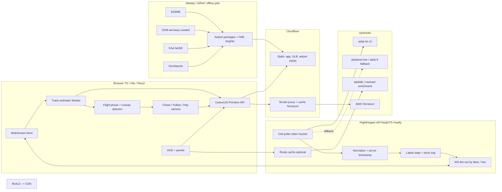

# FlightHopper — Hybrid System Plan (Best of Both)

**Status:** Proposed hybrid for dual-model review  
**Synthesized from:** GPT-5.6 Sol design + Claude Fable 5.1 design  
**Date:** 2026-09-22  
**Safety:** Entertainment / situational awareness only — **not for navigation, ATC, or operational decisions**

---

## Why a hybrid

Both designs agree on the spine. They diverge on depth vs. craft. This plan keeps Sol’s production discipline and Fable’s chase-view implementation specificity.

| Area | GPT Sol strength | Fable strength | Hybrid choice |
|---|---|---|---|
| Engine | Cesium-only ADR, strong alternative rejection | Deeper MapLibre-vs-Cesium camera critique | **CesiumJS only** |
| Backend | Provider-neutral adapters, SLOs, failure modes | Cloudflare terrain proxy, lean stack | **Thin Node/TS + Cloudflare edge** |
| Live data | Interest-driven cells, written production ToS | readsb-rich fields, fallbacks | **adsb.lol via fan-in poller + fallbacks** |
| Motion | 2–4 s delay, quality visibility, 8 s extrap cap | Cubic Hermite + velocity, tuning by source | **Delayed Hermite playback ~3–4 s** |
| Altitude/datums | Distinct baro/geom concepts, honest labels | **EGM96 mandatory**, gear clamp, geom-first near ground | **Fable altitude/datum policy** |
| Airports | OurAirports + **FAA NASR** + curated OSM | OurAirports + OSM + CIFP PG thresholds | **OA + NASR (US) + curated OSM; CIFP PG in v1** |
| Chase UX | Follow mode bridge, observed/derived labels | **Hop**, phase machine, camera presets, glide ribbon | **Both** |
| Storage MVP | Postgres/PostGIS early | Static versioned airport JSON | **Static packages for MVP; PostGIS when multi-region/search needs it** |
| Procedures | Explicitly defer CIFP | Glide ribbon first, CIFP v2 | **Ribbon in v1; CIFP procedures v2** |
| Ops | Test fixtures, ADRs, dataset registry | Estimator tables, size classes | **Both** |

---

## 1. Product vision (locked)

FlightHopper lets a user:

1. Browse live aircraft on a Cesium globe.
2. Select any aircraft → optional **Follow** (map-centered) → **Chase** (third-person behind/above).
3. See honest HUD: GS, ALT (baro/geom), VS, TRK, HDG when known, AGL when terrain available, data age, source quality.
4. Watch takeoffs/landings against real terrain and real runway geometry in near-real time (spectate delay ~3–4 s).
5. **Hop** (`N` / swipe) to the next interesting aircraft (on final > departing > nearest).

Non-goals: certified nav, ATC, collision avoidance, aerodynamic sim, claiming destination/runway as ATC truth.

---

## 2. Architecture (hybrid)

### Stack defaults

| Layer | Choice |
|---|---|
| Frontend | TypeScript, Vite, React (DOM only), Cesium `@cesium/engine`, Zustand, Web Worker estimator |
| Backend | Node 22, Fastify + `ws`, in-memory state; Redis only when 2+ replicas |
| Edge | Cloudflare Pages + Workers (terrain/imagery cache) + R2 for packages |
| Airports MVP | Versioned static JSON per ICAO (or region packs); PostGIS later for search/admin |
| Hosting | Fly.io / Hetzner 1–2 API instances |

### Hard architectural rules (from Sol)

1. Truth ≠ presentation: raw observations retained; render state separate.
2. Uncertainty visible: Observed / Derived / Stale / Unknown on every HUD field.
3. One upstream poll shared across all viewers of a cell.
4. Provider adapters: client never hard-couples to adsb.lol.
5. No silent dead reckoning beyond ~8–15 s; degrade then ghost/exit.
6. Licensing is a first-class dataset registry.

---

## 3. Data plane (hybrid)

### Live traffic

- **Primary:** adsb.lol `/v2/point/{lat}/{lon}/{r}` (and hex/callsign when chasing off-viewport).
- **Fan-in:** interest-driven cells (~1° or viewport-derived); poll ~1–2 Hz per active cell.
- **Fallback:** airplanes.live / adsb.fi only if whitelisted and ToS-ok; OpenSky for research/historical, not chase MVP.
- **Production gate:** obtain written confirmation / respect dynamic rate limits before public launch (Sol).

### Normalization

Server stamps `t_sample = t_received − seen_pos`. Preserve: hex, callsign, lat/lon, alt_baro, alt_geom, gs, track, baro_rate, geom_rate, true_heading, roll (if present), nav_*, squawk, category, mil/PIA/LADD flags, source quality.

### Motion (Fable craft + Sol caps)

- Render clock ≈ **live − 3–4 s** (playback buffer).
- **Cubic Hermite** (or equivalent velocity-aware) between samples.
- Extrapolate ≤ **8 s**; 8–15 s linear coast + fade; 15–30 s freeze/ghost; >30–60 s exit chase.
- Heavier smoothing for MLAT/TIS-B; disable fancy approach dots on MLAT.

### Altitude policy (Fable, with Sol honesty)

- Near ground / chase: prefer **alt_geom (HAE)** for model height.
- Display both baro and geom; never label track as heading.
- Terrain (Terrarium ≈ MSL) + airport elev → **EGM96 → HAE** in the build pipeline.
- `onGround` / `alt_baro == "ground"`: clamp to terrain HAE + **gear offset by size class**.
- Never claim “landed RWY X” as ATC fact — **likely runway** only.

### Phase detector (Fable)

State machine: Cruise / Descent / Approach / Final / Landing / Ground / TakeoffRoll / Climb. Drives HUD chips, runway highlight, camera auto-presets.

### Routes

Optional enrichment (adsbdb / routeset). Never foundational. Cache lookups; do not republish bulk route DB without permission.

---

## 4. Globe, chase camera, HUD

### Rendering

- Browse: billboards/icons; chase target: glTF via **Primitive API** (not Entity SampledPosition).
- Size-class models (GA → widebody) with manifest: gear height, length, axis fix.
- Calibration scene mandatory (known runway heading) before trusting HPR.

### Camera modes

1. **Browse** — top-down / oblique globe.
2. **Follow** — aircraft centered, map-like (Sol bridge mode).
3. **Chase presets** (Fable): High chase / Low chase / Wing / Runway / Tower; sticky lock; auto-switch on phase optional.
4. **Hop** — jump to next ranked aircraft without leaving chase.

Canonical offset scales by size class; critically damped heading follow (~0.5–1.2 s); horizon mostly level (optional 10–25% roll bleed); terrain collision min clearance ~5–20 m AGL.

### HUD

Primary: GS, ALT, VS, TRK (+ HDG when differs >3°), DATA AGE.  
Secondary: AGL, source badge, phase chip, likely runway, integrity.  
Units: aviation default + metric toggle.

### Approach wow (v1, not MVP-blocking)

Extended centerline + translucent **3° glidepath ribbon** + lateral/vertical deviation dots. CIFP full procedures deferred to v2.

---

## 5. Airport / terrain realism

| Priority | Source | Role |
|---|---|---|
| MVP | OurAirports | Global runway ends → rectangles |
| MVP | EGM96 + Terrarium via CF proxy | Terrain HAE, camera collision |
| MVP | Curated 5–20 “hero” airports | Higher-res OSM pavement where needed |
| v1 | FAA NASR | Authoritative US runway overrides |
| v1 | CIFP `PG` | US threshold elev / TCH refine |
| v1 | Approach ribbon | Visual approach aid |
| v2 | CIFP STAR/approach | Display-only procedures |
| Later | Photoreal / buildings | Optional, ToS-gated |

MVP success metric: touchdown at a hero airport looks geographically correct (aircraft meets runway within ~2 m vertically after datum correction; endpoints within 10–30 m).

---

## 6. Phased roadmap

### Phase 0 — Spike (1–2 weeks)

Cesium globe + proxy poll + one chase + minimal HUD + Hermite between samples + terrain height query.  
**Exit:** chase feels good on real noisy ADS-B; if not, stop and retune before airports.

### MVP — Impressive airport chase (4–8 weeks)

- Browse / select / Follow / Chase / Hop
- Backend cell poller + WS snapshot/delta
- Honest HUD + delayed playback
- OurAirports runways + Terrarium+EGM96
- 5–20 curated hero airports
- Probable-runway inference (labeled likely)
- Mobile battery-saver path
- Attribution + “not for navigation”
- Dataset registry + basic metrics (data age, FPS, 429s)

**Acceptance (merged):** smooth chase at 60/30 FPS; no extrap >8 s; camera clears terrain on test approaches; ground clamp works; provenance on every layer; production ToS path confirmed for primary feed.

### v1 — Approach realism + robustness (6–10 weeks)

- Glide ribbon + deviation dots
- NASR + CIFP PG US refine
- OSM taxi/apron at curated set
- Multi-replica Redis if needed
- Search, shareable links, degraded-mode UX
- Deterministic telemetry fixtures + visual regression set (Sol)

### v2 — Procedures & scale

- Negotiated bulk feed if public APIs insufficient
- CIFP procedures US-only, AIRAC lifecycle
- Optional history with privacy policy
- Optional premium imagery behind user key

---

## 7. Risks (must track)

1. **adsb.lol blocks / rate-limits production** → adapters + fallbacks + written agreement; interest-driven polling.
2. **Datum mismatch floats runways** → EGM96 from day one; ground clamp tests.
3. **Chase amplifies noise** → delay buffer + damping + MLAT degradation.
4. **CIFP / route rabbit hole** → ribbon first; procedures last.
5. **ODbL / ToS contamination** → dataset registry; separate OSM packaging.
6. **Mobile GPU/thermal** → LOD + FPS cap + feature flags.

---

## 8. Open decisions (recommended defaults)

| Question | Default |
|---|---|
| Commercial? | Start non-commercial / personal; keep ion off critical path |
| World on first load? | Regional interest; global symbols only if cheap |
| Military / PIA / LADD? | Filters exist; no sensational styling; respect LADD where required |
| Postgres in MVP? | **No** — static airport packs |
| CIFP in MVP? | **No** |
| Chase latency? | **3–4 s** playback |
| Primary model height? | **geom near ground**; show both |
| Entity vs Primitive? | **Primitive** for aircraft |

---

## 9. What each parent contributed (for reviewers)

**Kept from Sol:** Follow mode; Observed/Derived/Stale discipline; SLOs & ADRs mindset; interest-driven ingestion; NASR; provider-neutral adapters; production ToS gate; curated hero airports; test fixtures & failure modes; dataset registry; explicit non-goals.

**Kept from Fable:** EGM96+Terrarium day-one; Hermite delayed playback details; phase state machine; Hop; camera presets + auto phase; glidepath ribbon; Primitive API; size-class gear offsets; Cloudflare terrain proxy; static airport JSON pipeline; estimator tuning by source quality; glTF calibration scene.

**Rejected / deferred from both where weaker:** Sol’s early Postgres and Cesium-ion-first path (use free Terrarium+EGM96 immediately); Fable’s heavier reliance on airplanes.live/adsb.fi without ToS proof; both agree CIFP procedures are not MVP.
