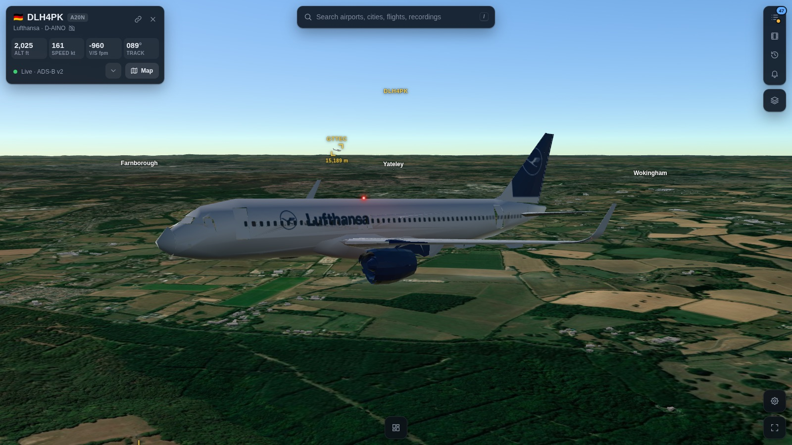
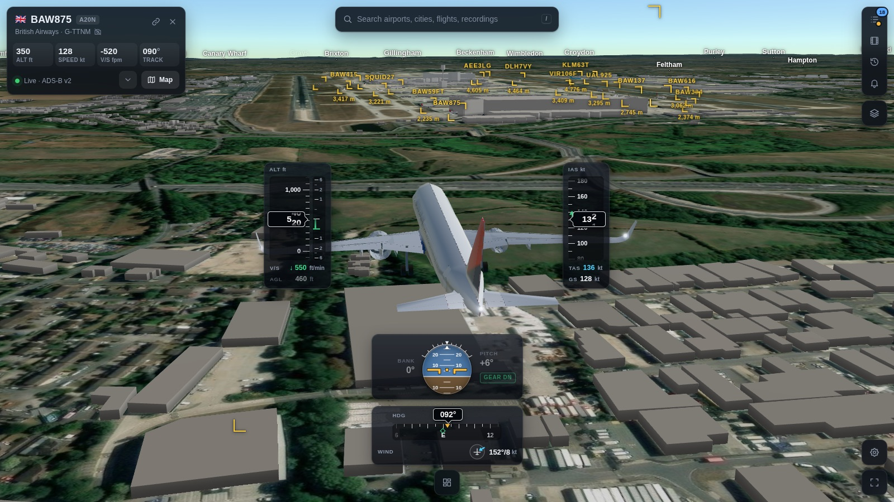
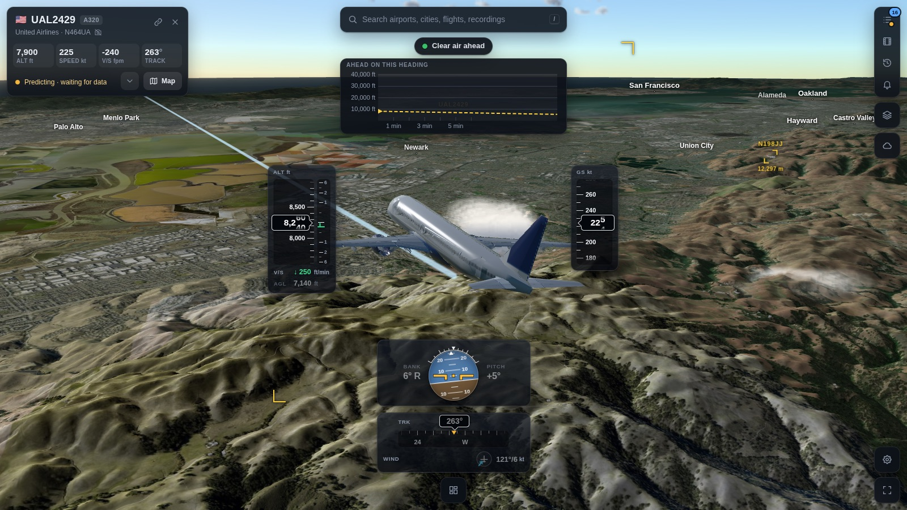
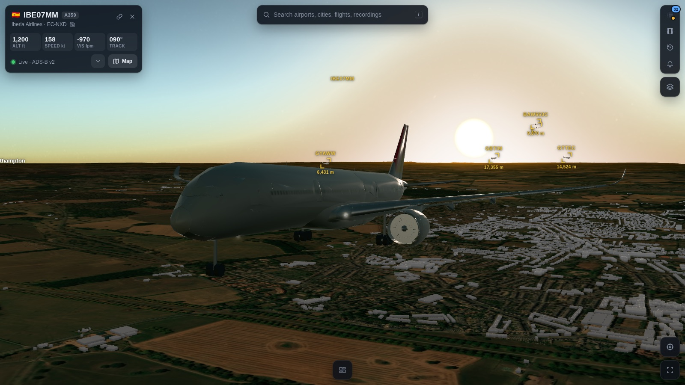
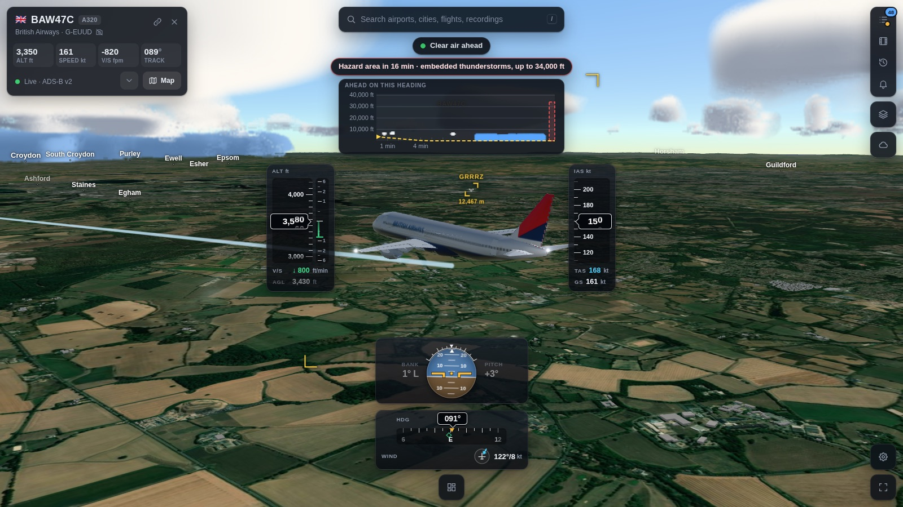
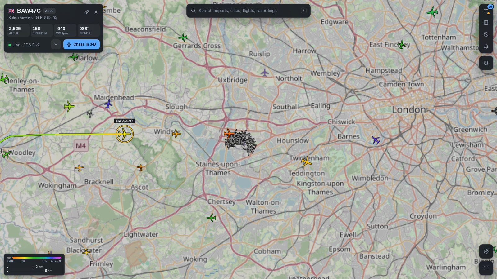
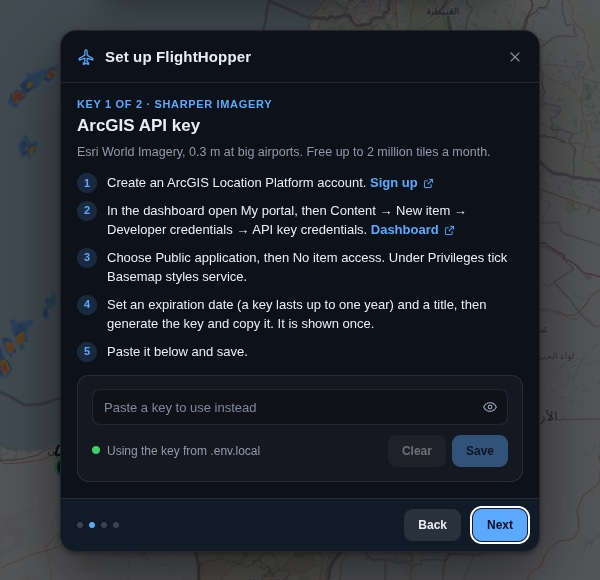

# FlightHopper

Live air traffic on a 3-D globe. Pick an aircraft and fly behind it over real terrain, down to the runway.



<table>
<tr>
<td width="50%"><br><sub>On final: flight instruments, 3-D buildings, the traffic ahead</sub></td>
<td width="50%"><br><sub>Real terrain under every flight</sub></td>
</tr>
<tr>
<td><br><sub>The sun and moon where they are at that hour</sub></td>
<td><br><sub>Night: cabin and navigation lights, street lights below</sub></td>
</tr>
<tr>
<td><br><sub>Weather round the aircraft, and what lies ahead</sub></td>
<td><br><sub>The live map: every aircraft in view, the selected one's path</sub></td>
</tr>
</table>

<sub>Screenshots of the app replaying recorded traffic at Heathrow and San Francisco. The sunset and night views set
the time of day with `?sun=`, the weather view shows the demo sky (`?wxdemo=1`), and the close-ups hide the instrument
cards with the layout button.</sub>

A personal, non-commercial project. **Entertainment only: not for navigation, ATC or any operational decision.**

## What it does

- **Live map.** Every aircraft in view from open ADS-B data, coloured by altitude. Search airports, cities and
  flights. A flight card shows the aircraft's photo, route and flown path.
- **Chase view.** Follow one aircraft in 3-D: real terrain, sun and moon light for the time of day, city lights at
  night, 3-D buildings, painted runways. Aircraft are type models in airline liveries, with landing gear, lights and
  glass-cockpit instruments. Nearby traffic is drawn too.
- **Weather.** Rain radar, airport reports and hazard areas on the map. In the chase, clouds, rain and storms are
  volumes round the aircraft.
- **History.** The map as it was at any time in the last 42 days, on a replay clock.
- **Recordings.** Record a flight with one button and replay it later.
- **Scenarios.** Reconstructed flights played back with a timeline and captions from the official record.
- **Alerts.** Emergency squawks worldwide and steep descents, with optional push to a phone.
- **Phone and TV.** A phone layout, and a kiosk mode driven by a TV remote ([tv/](tv/README.md)).

## Quick start

You need Node 24.2 or newer, npm and make.

```bash
git clone https://github.com/rg1989/FlightHopper.git
cd FlightHopper
make
```

`make` installs the dependencies the first time, starts the server with live traffic from adsb.fi and prints the link
(http://localhost:5173). Ctrl+C stops it. No account and no key is needed.

## Keys (optional)

Two free keys make the globe look better. On the first start a setup guide walks through both: where to sign up, what
to click, and a field that checks the key. Open it again from Settings → API keys → Setup guide.



| Key | Gives | Without it | Get it |
|---|---|---|---|
| ArcGIS API key | Esri World Imagery, 0.3 m at big airports | EOX Sentinel-2, 10 m | [location.arcgis.com](https://location.arcgis.com/sign-up/), free up to 2 million tiles a month |
| Cesium ion token | Cesium World Terrain | Re:Earth terrain | [ion.cesium.com](https://ion.cesium.com/signup/), free for personal use |

A key saved in the guide or in Settings stays in that browser and goes only to its own provider. You can also set
`VITE_ARCGIS_KEY` and `VITE_CESIUM_ION_TOKEN` in `.env.local`.

**Do not publish a build made with keys in `.env.local`.** Vite writes `VITE_*` values into the JavaScript bundle. For
a public deployment build without them and let each visitor add their own in Settings.

## Commands

| Command | What it does |
|---|---|
| `make` | Live traffic from adsb.fi, and the client |
| `make replay` | The same, replaying the newest recording in `data/recordings/`, or the bundled fixtures |
| `make live LIVE_SOURCE=adsblol` | Live from adsb.lol (needs `CONTACT`) |
| `npm run check` | Type-check and all tests |
| `npm run build` | The client, built into `dist/` |
| `npm run server` | The API server alone. It also serves `dist/`, on port 8787 |

## Configuration

Server settings are environment variables. `npm run server` and `make` read them from `.env.local`.
[`.env.example`](.env.example) lists them all. The ones you may want:

| Variable | Default | What it is |
|---|---|---|
| `ADSB_SOURCE` | `replay` (`make` sets `adsbfi`) | `adsbfi`, `adsblol`, `readsb` (your own receiver) or `replay` |
| `CONTACT` | none | An email or URL for the User-Agent. adsb.lol requires it |
| `PORT` | `8787` | The API server's port |
| `READSB_URL`, `READSB_COVERAGE` | | Your receiver's address and its coverage as `lat,lon,nm` |
| `EVENTS_DIR` | none (`make` sets `data/events`) | Where alerts keep their switch and log. Unset: no alerts |
| `NTFY_URL` | none | An [ntfy](https://ntfy.sh) topic that each new alert is pushed to. Treat it as a secret |

Useful links into the app: `?hex=<icao>&chase=1` chases an aircraft, `?scenario=<id>` plays a scenario,
`?hist=<unix seconds>` opens the past, `?tv=1` is the TV kiosk, `?setup=1` opens the setup guide.
Settings → Controls lists the keyboard shortcuts.

## Layout

| Path | What is in it |
|---|---|
| `client/` | The browser app: CesiumJS scene, UI, track smoothing, scenarios, history |
| `server/` | The API server: polls the flight data source, weather, history, alerts, recordings |
| `shared/` | Types and maths used by both |
| `public/` | Aircraft models, liveries, airports, scenario packages, map overlays |
| `tools/` | Scripts that build the data in `public/`, recorders and benchmarks |
| `harness/` | Single-feature pages for development |
| `tv/` | The TV setup |
| `third_party/` | Source of the GPL aircraft models |
| `.planning/` | Design notes and work plans, kept as the project's log |

No framework: TypeScript run by Node directly, Vite for the client, `node --test` for tests.

## More documentation

- [History](docs/history.md): flown paths and the replay of the past
- [Weather in the chase](docs/weather.md): the Weather menu, its looks and its check aids
- [Scenarios](docs/scenarios.md): the package format, and how to prepare one
- [Liveries and type models](docs/liveries.md): how to add an aircraft or an airline
- [Alerts](docs/anomaly-alerts.md): sources, rules and limits
- [Aircraft models](third_party/aircraft-models/README.md): licences and corresponding source
- [Data sources](docs/data-sources.md): what is read from where, and how the bundled data is rebuilt
- [Test fixtures](data/fixtures/README.md)

## Data sources and credits

- **Live aircraft:** [adsb.fi](https://adsb.fi) open data (personal, non-commercial use), the default.
  [adsb.lol](https://adsb.lol) for recordings and `LIVE_SOURCE=adsblol`: data © adsb.lol contributors,
  [ODbL 1.0](https://opendatacommons.org/licenses/odbl/1-0/).
- **The past:** adsb.lol's heatmap files and per-aircraft traces, the same ODbL 1.0 data.
- **Aircraft types in the past:** contains information from the
  [Mictronics aircraft database](https://github.com/Mictronics/aircraft-database), made available under the
  [ODC Attribution License](https://opendatacommons.org/licenses/by/1-0/).
- **Airports and runways:** [OurAirports](https://ourairports.com/data/) (public domain).
- **Airport weather and hazard areas:** the [aviationweather.gov](https://aviationweather.gov/data/api/) Data API.
- **Rain radar:** [RainViewer](https://www.rainviewer.com/api.html).
- **Weather model:** weather data by [Open-Meteo.com](https://open-meteo.com/),
  [CC BY 4.0](https://creativecommons.org/licenses/by/4.0/), free for non-commercial use.
- **Places:** OurAirports and [GeoNames](https://www.geonames.org/)
  ([CC BY 4.0](https://creativecommons.org/licenses/by/4.0/)).
- **Borders and names in the chase:** [Natural Earth](https://www.naturalearthdata.com/) (public domain).
- **Street map and buildings:** © [OpenStreetMap](https://www.openstreetmap.org/copyright) contributors, with
  vector tiles from [OpenFreeMap](https://openfreemap.org/).
- **Aircraft photos:** [Planespotters.net](https://www.planespotters.net/). **Routes:** [adsbdb.com](https://www.adsbdb.com/).
- **City lights at night:** NASA VIIRS Black Marble.
- **Terrain and imagery:** Re:Earth terrain, EOX Sentinel-2 cloudless, Esri World Imagery, Cesium ion.
- **Aircraft models:** from FlightGear aircraft, GPL. See [third_party/aircraft-models](third_party/aircraft-models/README.md).

Each source has its own terms: see [docs/data-sources.md](docs/data-sources.md). Read them before you use
FlightHopper for anything but personal use.

## Licence

The code is under the [MIT licence](LICENSE). That does not cover what the repository bundles from others:

- **Aircraft models** in `public/models/`: GPL-2.0 or GPL-3.0, from FlightGear aircraft. Their licences and source are
  in [third_party/aircraft-models](third_party/aircraft-models/README.md).
- **Fonts** in `public/fonts/`: SIL Open Font License, each with its licence file beside it.
- **Airline names and marks** on the liveries belong to their owners.
- **Data fetched while the app runs**: each source's own terms, listed above.

## Questions and bugs

Open an [issue](https://github.com/rg1989/FlightHopper/issues).
